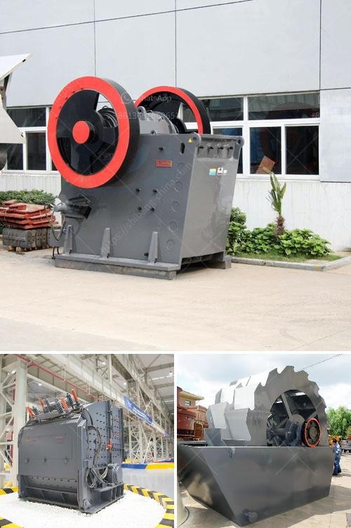

<h3>conveyor belts specifications</h3>
Conveyor belts are an integral part of various industries, facilitating the efficient transportation of products and materials from one point to another. However, not all conveyor belts are created equal. They come in various sizes, designs, and specifications to suit specific operational requirements. Understanding these specifications is crucial in selecting the right conveyor belt for your business needs.

One of the essential aspects to consider when choosing a conveyor belt is its width. Conveyor belts can range from a few inches to several feet in width, depending on the application. The width of the belt determines its capacity and the amount of material it can carry at a given time. It is crucial to select a belt width that matches the requirements of your operation to ensure efficient and smooth material handling.

Another critical specification is the length of the conveyor belt. The length determines how far the belt can span between two points and directly affects the layout of your facility. Conveyor belts can be customized to specific lengths, allowing businesses to optimize their space utilization. It is important to measure the distance between transfer points accurately and communicate this information to the conveyor belt manufacturer to ensure a proper fit.

The thickness of the conveyor belt is also a critical specification. The thickness, often referred to as the gauge, determines the belt's durability and lifespan. A thicker belt can withstand more wear and tear, making it suitable for heavy-duty applications. However, it is essential to strike a balance between belt thickness and flexibility to avoid excessive strain on the drive system. Consulting with a conveyor belt expert can help determine the ideal thickness for your specific needs.

The material composition of the belt is another key consideration. Conveyor belts are typically made from rubber, PVC, or various synthetic materials. Each material has its own unique properties, making it suitable for specific applications. For example, rubber belts offer excellent adhesion and resistance to abrasion, making them ideal for mining and heavy industries. PVC belts, on the other hand, are more lightweight and flexible, making them suitable for food processing and manufacturing industries. Choosing the right material composition ensures optimal performance and longevity of the conveyor belt.

Additionally, the tensile strength and load capacity of the conveyor belt are crucial specifications to consider. Tensile strength refers to the maximum force the belt can handle without experiencing a failure or breakage. Load capacity correlates with the belt's width and thickness, determining the maximum weight it can handle. It is essential to assess the average and peak loads in your operation and select a conveyor belt with an appropriate tensile strength and load capacity to ensure safe and efficient material transportation.

In conclusion, conveyor belts are available in different specifications to cater to various industries and applications. Key considerations when selecting a conveyor belt include its width, length, thickness, material composition, tensile strength, and load capacity. It is important to analyze your operational requirements and consult with experts to identify the most suitable conveyor belt for your business needs. Proper selection and maintenance of the conveyor belt will ensure enhanced productivity, reduced downtime, and improved overall efficiency.
<h3>Contact us</h3><ul><li><strong>Whatsapp:&nbsp;<a href="https://wa.me/8613661969651">+8613661969651</a></strong></li><li><a href="https://swt.shibang-china.com/?git&amp;zhl&amp;conveyor belts specifications"><strong>Online Service(chat now)</strong></a></li></ul><h3>Related</h3><ul><li><a href='ceremacs ball mill pictures.md'>ceremacs ball mill pictures</a></li><li><a href='the largest stone crusher system.md'>the largest stone crusher system</a></li><li><a href='iron ore crushers.md'>iron ore crushers</a></li><li><a href='aggregate crushing machine portable.md'>aggregate crushing machine portable</a></li><li><a href='micron grinding mill nigeria.md'>micron grinding mill nigeria</a></li></ul>