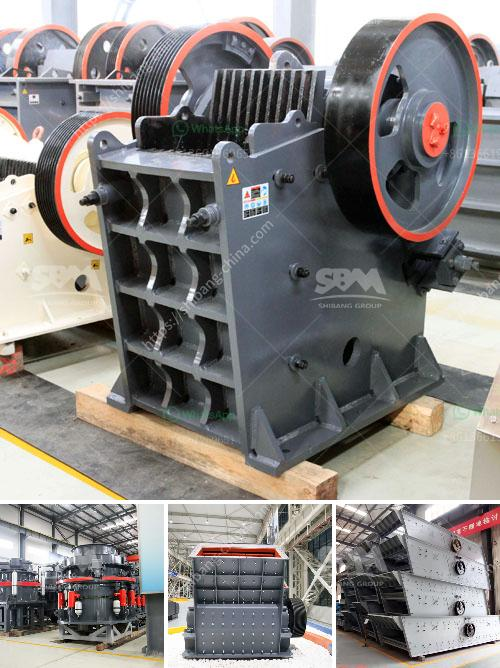

<h3>copper concentrate plant manufacturers in south africa</h3>
Copper is one of the world's most important industrial minerals, and Africa is an important global copper producer. South Africa is one of the world's leading copper concentrate producers, and with its abundance of resources, it is a key player in the global copper mining industry.

Copper concentrate is used in various industries, including electrical and electronics, automotive, construction, and machinery. It is essential in the manufacturing of electrical wires, cables, transformers, motors, and generators. With the increasing demand for copper concentrate, the production of this mineral has gained immense importance in South Africa.

In South Africa, several companies are engaged in the production and distribution of copper concentrate, and they play a significant role in the country's economy. These manufacturers have established plants that efficiently process copper ore into high-quality concentrate. These plants often employ advanced technological processes to ensure the extraction of copper at the highest possible levels of purity.

One prominent copper concentrate plant manufacturer in South Africa is Palabora Copper. Palabora Copper has been operational since the early 1960s and is known for its high-quality copper concentrate production. In addition to copper concentrate, the company also produces by-products such as magnetite, vermiculite, and anode slimes, among others. Palabora Copper's plant operates through a unique integrated mining-to-metals process, which ensures the efficient production of copper concentrate.

Another leading copper concentrate plant manufacturer in South Africa is Vedanta Zinc International, a subsidiary of Vedanta Resources. Vedanta Zinc International operates the Black Mountain Mine near Aggeneys in South Africa's Northern Cape province. The mine produces copper concentrate, zinc concentrate, and lead concentrate. Vedanta Zinc International's plant utilizes state-of-the-art technology to produce high-quality copper concentrate.

Other notable copper concentrate plant manufacturers in South Africa include Exxaro Resources and African Rainbow Minerals. These companies have made significant contributions to South Africa's copper mining industry, ensuring the efficient extraction and production of copper concentrate.

In conclusion, South Africa is a key player in the global copper mining industry, with several copper concentrate plant manufacturers operating in the country. These manufacturers employ advanced technological processes to ensure the production of high-quality copper concentrate. The production of copper concentrate in South Africa contributes significantly to the country's economy and supports various industries that rely on this important mineral.
<h3>Contact us</h3><ul><li><strong>Whatsapp:&nbsp;<a href="https://wa.me/8613661969651">+8613661969651</a></strong></li><li><a href="https://swt.shibang-china.com/?git&amp;zhl&amp;copper concentrate plant manufacturers in south africa"><strong>Online Service(chat now)</strong></a></li></ul><h3>Related</h3><ul><li><a href='aggregate machine in south africa.md'>aggregate machine in south africa</a></li><li><a href='kenya mobile crusher philippines.md'>kenya mobile crusher philippines</a></li><li><a href='hammer mills hammer mills.md'>hammer mills hammer mills</a></li><li><a href='german crusher plants.md'>german crusher plants</a></li><li><a href='fine grinding mill.md'>fine grinding mill</a></li></ul>