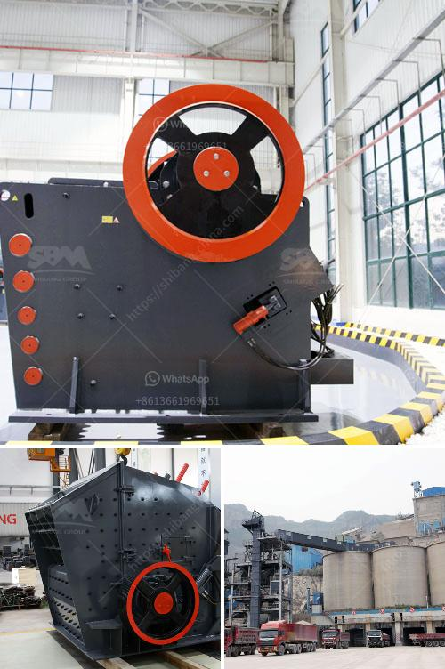

<h3>copper gold processing plant</h3>
Copper and gold are two valuable metals found in abundance in the Earth's crust. They have been used for various purposes by civilizations for centuries. Copper is commonly used in electrical wiring, plumbing, and electronics, while gold is primarily known for its use in jewelry and as a store of value. Both of these metals have high demand in the global market, leading to the establishment of copper gold processing plants worldwide.

A copper gold processing plant is a facility that utilizes the various properties of copper and gold to extract valuable metals from ore deposits. Copper gold processing plants are common in countries where these metals are mined. The process begins with crushing and grinding the ore to a fine powder. The powdered ore is then mixed with water and chemicals to create a slurry, which is heated and agitated to allow the copper and gold particles to separate from the rest of the ore.

The next step in the process is the flotation process, where the slurry is mixed with air bubbles. The copper and gold particles attach themselves to the bubbles, which then rise to the surface of the mixture. This forms a froth layer, which is skimmed off, leaving behind the copper and gold concentrate. The concentrate is then dried and filtered to remove excess moisture.

The final step in the copper gold processing plant is smelting, where the concentrate is melted at high temperatures to separate the copper and gold. The molten metal is then poured into molds to cool and harden, forming copper and gold bars or other desired shapes. The bars can be further processed and refined to remove impurities and increase purity.

Copper gold processing plants can vary in size and capacity depending on the ore deposits and the desired output. Some plants process thousands of tons of ore per day, while others process smaller amounts. These plants require heavy machinery, such as crushers, ball mills, flotation cells, and smelting furnaces, as well as skilled workers to operate and maintain the equipment.

The establishment of a copper gold processing plant brings several benefits to the local community and the broader economy. It creates job opportunities for skilled workers, boosts local businesses that provide goods and services to the plant, and generates tax revenues for the government. Additionally, the processed copper and gold can be sold on the global market, contributing to the country's export earnings.

However, the operation of copper gold processing plants also raises environmental concerns. The extraction process can produce waste materials, such as tailings, which contain chemicals and minerals that may harm the environment if not properly managed. Efforts are made to minimize the environmental impact by implementing measures to reduce water and energy consumption, and optimizing the use of reagents in the flotation process. Additionally, tailings are often stored in specially designed facilities to prevent contamination of water sources.

In conclusion, copper gold processing plants are crucial for extracting valuable metals from ore deposits. They play a significant role in meeting global demand for copper and gold while providing economic benefits to the local community. However, it is essential to ensure that these plants are operated in an environmentally responsible manner to minimize their impact on the environment.
<h3>Contact us</h3><ul><li><strong>Whatsapp:&nbsp;<a href="https://wa.me/8613661969651">+8613661969651</a></strong></li><li><a href="https://swt.shibang-china.com/?git&amp;zhl&amp;copper gold processing plant"><strong>Online Service(chat now)</strong></a></li></ul><h3>Related</h3><ul><li><a href='iron ore concentrate prices.md'>iron ore concentrate prices</a></li><li><a href='primary crusher pe 400x600 pm 15 single.md'>primary crusher pe 400x600 pm 15 single</a></li><li><a href='difference between vsi and hsi.md'>difference between vsi and hsi</a></li><li><a href='stone crusher for sale in usa.md'>stone crusher for sale in usa</a></li><li><a href='plant layout mini cement plant pdf.md'>plant layout mini cement plant pdf</a></li></ul>