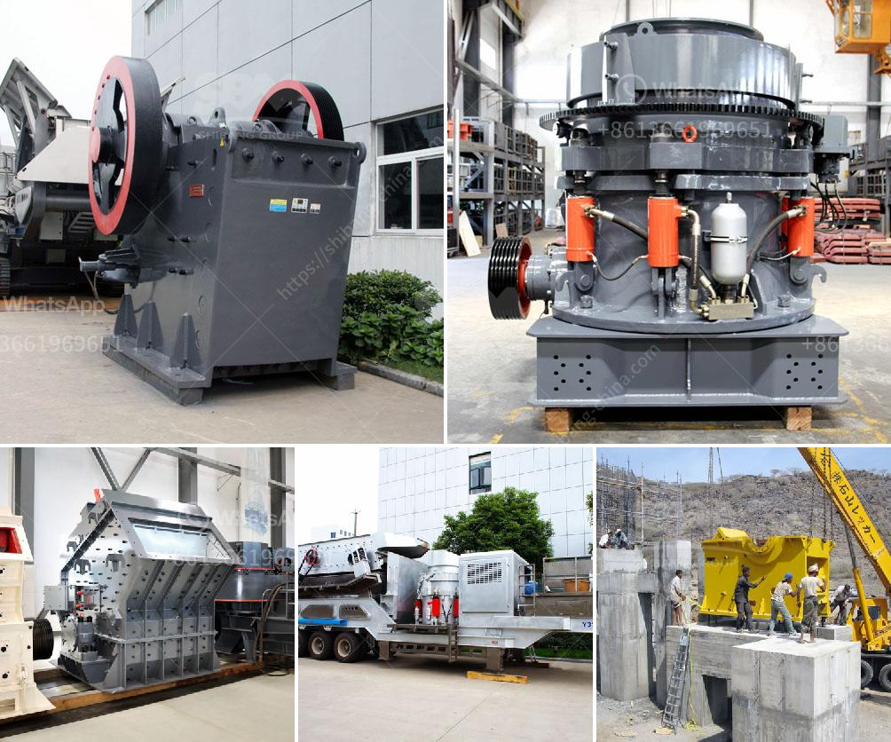

<h3>copper leaching plants for sale</h3>
Copper leaching is a commonly used method for extracting copper from ore. It involves the dissolution of copper minerals from the ore with the help of leaching agents, such as sulfuric acid or ammonia. This process plays a crucial role in the production of copper, as it allows for the recycling of valuable copper from low-grade ores and the recovery of copper from waste materials.

For those in the mining industry looking to upgrade or expand their copper leaching operations, the availability of quality leaching plants is of utmost importance. Fortunately, there are various copper leaching plants for sale that can help improve the efficiency and profitability of copper extraction processes.

One significant advantage of investing in a copper leaching plant is the ability to achieve a higher copper recovery rate. These plants are often designed with innovative technologies, allowing for optimized leaching conditions and enhanced copper dissolution. In turn, this results in increased copper yields, maximized resource utilization, and reduced environmental impact.

Moreover, modern copper leaching plants are built with robust and durable equipment, ensuring long-term operation and minimal downtime due to maintenance. These plants are equipped with efficient processing systems, including agitation tanks, filters, and solvent extraction units, to facilitate reliable copper recovery.

In addition to improving copper extraction, investing in a copper leaching plant can offer operational flexibility. With the ability to customize leaching parameters and process variations, these plants provide the adaptability needed to address changes in ore characteristics or market demands. This allows mining companies to respond effectively to fluctuating copper prices or shifts in copper grade and composition.

In conclusion, copper leaching plants for sale present an excellent opportunity for mining companies seeking to increase copper recovery, boost profitability, and mitigate environmental impact. These plants integrate advanced technologies, ensuring improved copper dissolution and higher yields. Additionally, they offer operational flexibility, allowing companies to adapt to changing market conditions. As the demand for copper continues to rise, the utilization of efficient leaching plants becomes increasingly imperative for sustainable copper production.
<h3>Contact us</h3><ul><li><strong>Whatsapp:&nbsp;<a href="https://wa.me/8613661969651">+8613661969651</a></strong></li><li><a href="https://swt.shibang-china.com/?git&amp;zhl&amp;copper leaching plants for sale"><strong>Online Service(chat now)</strong></a></li></ul><h3>Related</h3><ul><li><a href='conveyor belt supplies south africa.md'>conveyor belt supplies south africa</a></li><li><a href='rental of crusher in malaysia.md'>rental of crusher in malaysia</a></li><li><a href='vertical grinding mill types for cement plants.md'>vertical grinding mill types for cement plants</a></li><li><a href='mineral used for making talcum powder.md'>mineral used for making talcum powder</a></li><li><a href='captains of crusher zenith.md'>captains of crusher zenith</a></li></ul>