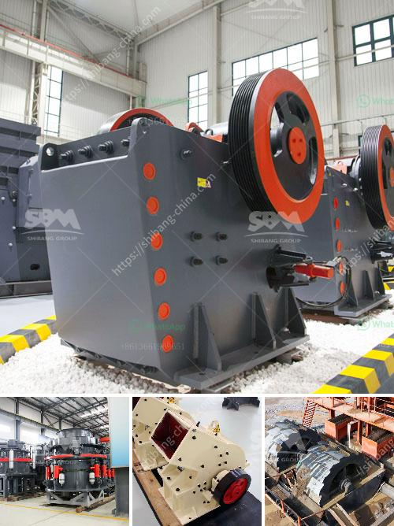

<h3>copper mining equipment suppliers south america</h3>
Copper mining in South America has a long-standing history, with countries like Chile and Peru being at the forefront of copper production in the region. To support this booming industry, copper mining equipment suppliers in South America are experiencing high demand for their products.

Copper mining plays a crucial role in the economies of many South American countries. Chile is the world's largest copper producer, accounting for approximately 28% of global copper output. Its vast copper deposits attract numerous mining companies, both domestic and international, requiring top-notch copper mining equipment.

In recent years, advancements in mining technology have significantly increased the efficiency and productivity of copper mining operations. To meet these demands, copper mining equipment suppliers in South America deliver state-of-the-art equipment, including big trucks, excavation machines, and drill rigs.

One key player in the South American copper mining equipment market is Caterpillar. The renowned manufacturer offers a wide range of mining equipment, suitable for various mining operations. With its extensive product line, Caterpillar provides specialized machines designed specifically for copper mining, such as haul trucks and hydraulic shovels. These highly capable machines ensure efficient exploration and extraction of copper ore.

Another prominent copper mining equipment supplier in South America is Komatsu, a leading manufacturer of construction and mining equipment worldwide. Komatsu's extensive portfolio includes machinery for all stages of copper mining. Their mining trucks and loaders are designed to handle the harsh conditions encountered in copper mines, ensuring reliable operation and maximum productivity.

Additionally, Sandvik, a Swedish company, has made its mark in the copper mining industry by offering a comprehensive package of mining equipment solutions. Sandvik's range of products includes underground loaders and trucks, as well as rock drills and bolters. These cutting-edge machines are specially designed for underground copper mining, providing efficient and safe operations.

Apart from global suppliers, South America also has local manufacturers catering to the specific needs of the region's copper mining industry. These local suppliers understand the unique challenges faced by miners in South American terrains and offer tailored solutions to meet their requirements. Companies like Dino Trucks and Parts, based in Chile, provide specialized equipment and spare parts for the copper mining industry, ensuring timely support and maintenance for mining operations.

In conclusion, the demand for copper mining equipment in South America remains strong due to the region's extensive copper deposits and the continuous expansion of the mining industry. Global manufacturers like Caterpillar, Komatsu, and Sandvik, along with local suppliers, play a vital role in supplying high-quality equipment that enhances productivity and efficiency in copper mining operations. As the industry continues to grow, copper mining equipment suppliers in South America are expected to witness further increase in demand, driving further innovation and technological advancements in the field.
<h3>Contact us</h3><ul><li><strong>Whatsapp:&nbsp;<a href="https://wa.me/8613661969651">+8613661969651</a></strong></li><li><a href="https://swt.shibang-china.com/?git&amp;zhl&amp;copper mining equipment suppliers south america"><strong>Online Service(chat now)</strong></a></li></ul><h3>Related</h3><ul><li><a href='stone crusher permission maharashtra.md'>stone crusher permission maharashtra</a></li><li><a href='marble stone sheet production line.md'>marble stone sheet production line</a></li><li><a href='the largest stone crusher system.md'>the largest stone crusher system</a></li><li><a href='quarry machine manufacturers.md'>quarry machine manufacturers</a></li><li><a href='stone rock crushers in oman for sale.md'>stone rock crushers in oman for sale</a></li></ul>