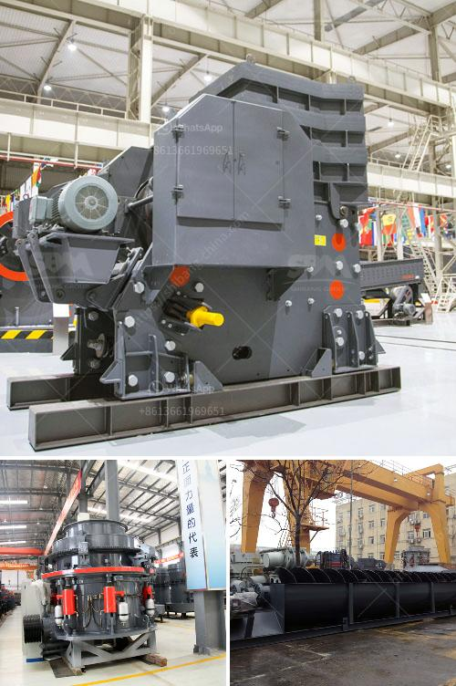

<h3>copper ore concentration plant supplier</h3>
The demand for copper continues to grow worldwide as countries such as China and India continue to develop and their middle class populations rise. This increase in demand has brought about a rise in prices, making copper mining a lucrative business. To meet this demand, a copper ore concentration plant with robust and reliable equipment is crucial. This article explores the significance of a copper ore concentration plant supplier and the benefits it brings to the mining industry.

A copper ore concentration plant is a critical component in the mining industry, specifically for the extraction process. Copper ore concentration refers to the methods used to obtain copper from its ores. The process of copper ore concentration involves several stages: crushing and grinding the ore to a specific size, separating the copper minerals from the gangue, and finally, producing a copper concentrate. The concentrate obtained from these processes is then smelted to produce pure copper metal. A concentration plant is responsible for enhancing the copper content and removing impurities from the ore before smelting.

Having a reliable and efficient copper ore concentration plant supplier is crucial for the success of a mining company. Firstly, a good supplier will ensure that the concentration plant is equipped with high-quality equipment that meets industry standards. This includes crushers, grinders, classifiers, flotation cells, thickeners, filters, and other equipment necessary for the concentration process. By using reliable equipment, companies can maximize copper extraction, improve efficiency, and reduce operational costs.

Secondly, a reputable concentration plant supplier will provide technical support and assistance throughout the project's lifespan. They will offer expertise in plant design, process optimization, and maintenance, ensuring that the plant operates at its highest efficiency. This support is vital in increasing the overall productivity of the plant and minimizing downtime, which can significantly impact the mining company's bottom line.

Additionally, a copper ore concentration plant supplier can offer customized solutions specific to the needs of each mining company. They understand that each ore deposit is unique and requires tailored processes for optimal extraction. By working closely with the mining company, the supplier can design a plant that is optimized for the specific ore characteristics, maximizing copper recovery and minimizing environmental impact.

Moreover, partnering with a reliable supplier reduces the risks associated with the concentration plant's construction and operation. A reputable supplier will have a proven track record and adhere to strict safety and environmental standards. This ensures that the plant is constructed and operated in a safe and sustainable manner, minimizing any potential adverse impacts on the surrounding environment and local communities.

In conclusion, a copper ore concentration plant supplier plays a crucial role in the mining industry by providing essential equipment, technical support, and customized solutions. The demand for copper continues to rise, making the need for efficient concentration plants more significant than ever. By partnering with a reliable supplier, mining companies can optimize their copper extraction processes, increase productivity, and reduce operational costs. The benefits of having a robust and reliable copper ore concentration plant supplier are vast, proving that this partnership is indeed a world full of opportunities.
<h3>Contact us</h3><ul><li><strong>Whatsapp:&nbsp;<a href="https://wa.me/8613661969651">+8613661969651</a></strong></li><li><a href="https://swt.shibang-china.com/?git&amp;zhl&amp;copper ore concentration plant supplier"><strong>Online Service(chat now)</strong></a></li></ul><h3>Related</h3><ul><li><a href='slag grinding mill india.md'>slag grinding mill india</a></li><li><a href='crusher mobile crusher peru.md'>crusher mobile crusher peru</a></li><li><a href='drawing for raymond mill.md'>drawing for raymond mill</a></li><li><a href='grinding mill spare parts manufacturers china.md'>grinding mill spare parts manufacturers china</a></li><li><a href='gold plant for sale philippines.md'>gold plant for sale philippines</a></li></ul>