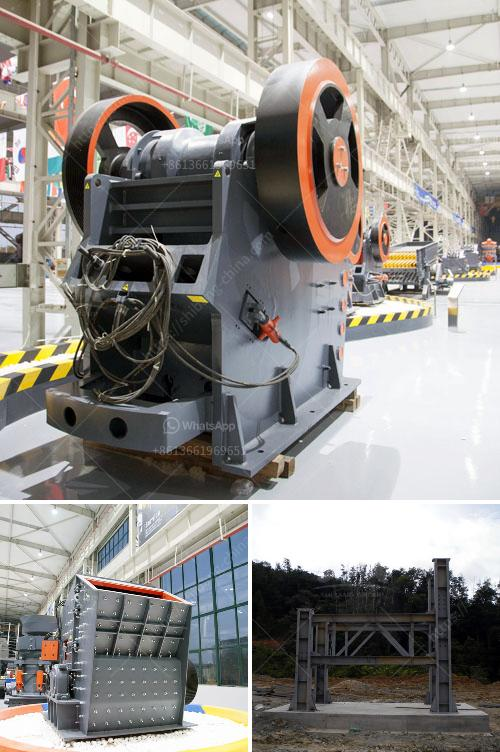

<h3>copper ore processing plant in philippines</h3>
Copper is one of the most abundant resources in the Philippines, with its mining industry making a significant contribution to the country’s economy. Copper ranks third in global commodity production, after iron and aluminum. The Philippines has a vast reserve of copper ore, with an estimated 4.5 billion tons of combined identified and inferred reserves.

To tap into this vast resource, several mining companies in the Philippines have made substantial investments in copper ore processing plants. Copper is extracted through the process of smelting, leaching, and electrolysis. These processes involve melting the ore at high temperatures, which separates the metal from impurities and allows it to be refined into a more usable form.

The design and engineering of copper ore processing plants in the Philippines are meticulously planned and executed to ensure the highest levels of efficiency and productivity. The plants are specifically designed to produce copper concentrate, which is a semi-processed product that can be further processed into refined copper. The concentrate contains approximately 25-35% copper, along with other valuable minerals such as gold and silver.

Copper ore processing plants in the Philippines typically include the following stages: crushing and grinding of the ore, flotation, and smelting. Crushing and grinding transform the raw ore into a smaller, more manageable size for further processing. Froth flotation is used to separate the copper minerals from the gangue minerals, allowing the copper concentrate to be collected.

Once the concentrate is collected, it is sent to a smelter for further processing. Smelting involves melting the copper concentrate at high temperatures, which removes impurities and leaves behind a more pure copper product. The resulting product, known as blister copper, is about 99% pure and can be further refined through additional processes to reach a commercial-grade level of purity.

In the Philippines, there are several copper ore processing plants strategically located near the mines to minimize transportation costs. These plants are equipped with the latest technologies and machinery to ensure efficient and environmentally friendly processing. They also adhere to stringent safety and environmental regulations to minimize any negative impact on the surrounding communities and ecosystems.

The copper industry in the Philippines has faced some challenges in recent years, particularly regarding environmental concerns. However, the industry has made significant efforts to address these issues through sustainable mining practices and strict environmental regulations. Copper ore processing plants in the Philippines continuously strive to improve their processes and technologies to minimize their environmental footprint and ensure the welfare of the local communities.

In conclusion, copper ore processing plants in the Philippines play a crucial role in the mining industry. They not only contribute to the country’s economy but also provide employment opportunities and support sustainable development. The industry’s commitment to environmental responsibility and community welfare ensures that the processing of copper ore is conducted safely and responsibly, benefiting both the industry and the Philippines as a whole.
<h3>Contact us</h3><ul><li><strong>Whatsapp:&nbsp;<a href="https://wa.me/8613661969651">+8613661969651</a></strong></li><li><a href="https://swt.shibang-china.com/?git&amp;zhl&amp;copper ore processing plant in philippines"><strong>Online Service(chat now)</strong></a></li></ul><h3>Related</h3><ul><li><a href='for sale rock crushing plant 150 tons.md'>for sale rock crushing plant 150 tons</a></li><li><a href='pulverizer limestone crusher manufacturer in india.md'>pulverizer limestone crusher manufacturer in india</a></li><li><a href='gypsum powder industry basic machines.md'>gypsum powder industry basic machines</a></li><li><a href='gypsum processing equipment.md'>gypsum processing equipment</a></li><li><a href='rental of crusher in malaysia.md'>rental of crusher in malaysia</a></li></ul>