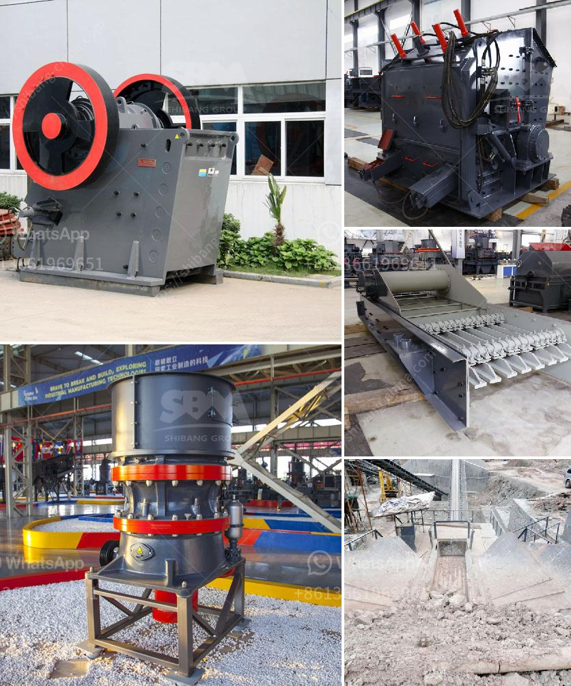

<h3>copper processing plant</h3>
Copper is a versatile metal that has been used by humans for thousands of years. It is one of the most widely used metals in various industries, including construction, electronics, and telecommunications. To meet the growing demand for copper, copper processing plants play a vital role in ensuring a continuous supply of this valuable metal.

A copper processing plant is where the concentrate containing copper minerals is extracted from raw ore. The extracted copper oxide ore is then treated by various mineral processing methods to produce copper concentrate, which is a refined product used in metal fabrication processes. Copper smelting is the primary method used to extract copper from its ore, but different methods are necessary for producing copper concentrate suitable for smelting.

The process of copper processing starts with the crushing and grinding of the mined ore. This prepares the ore for further processing, allowing it to be fully separated from the gangue minerals. After grinding, the ore is passed through a series of flotation cells, where air and chemicals are introduced to separate the copper minerals from the gangue.

The flotation process involves the use of chemicals known as collectors, which selectively bind to the desired minerals, allowing them to be skimmed off as a froth layer. This froth, containing the copper minerals, is then further processed to remove impurities and increase the copper content. This process is known as copper flotation.

Once the copper concentrate is produced, it is transported to a copper smelter, where it is further purified and converted into copper anodes. The anodes are then electrolytically refined to remove impurities, producing pure copper cathodes that are used in various industries.

Copper processing plants are typically large-scale operations, requiring substantial infrastructure and machinery. They often include crushing and grinding circuits, flotation cells, thickeners, filters, and smelters. These plants are designed to handle large volumes of ore and produce high-quality copper concentrate efficiently.

In recent years, there has been a growing emphasis on environmental sustainability in the mining industry. Copper processing plants are implementing various technologies and practices to reduce their environmental impact. For instance, water recycling systems are being used to minimize the amount of freshwater used in the processing plants. Additionally, measures are being taken to reduce energy consumption and greenhouse gas emissions, including the use of renewable energy sources and improved smelting technologies.

The development of copper processing plants also contributes to the local economy by creating jobs and fostering economic growth. These plants require a skilled workforce, ranging from engineers and technicians to operators and maintenance personnel. Furthermore, the establishment of processing plants in a region often leads to the development of supporting industries, such as logistics and supply chains.

In conclusion, copper processing plants play a crucial role in meeting the global demand for copper. These plants extract the copper minerals from raw ore and produce refined copper concentrate, which is used in various industries. The development of copper processing plants has improved the efficiency of copper production while reducing the environmental impact. It also contributes to local economies by creating jobs and promoting economic growth. With the increasing demand for copper, investments in copper processing plants are expected to continue in the coming years.
<h3>Contact us</h3><ul><li><strong>Whatsapp:&nbsp;<a href="https://wa.me/8613661969651">+8613661969651</a></strong></li><li><a href="https://swt.shibang-china.com/?git&amp;zhl&amp;copper processing plant"><strong>Online Service(chat now)</strong></a></li></ul><h3>Related</h3><ul><li><a href='clinker grinding plant manufacturers germany.md'>clinker grinding plant manufacturers germany</a></li><li><a href='grinding media balls turkey.md'>grinding media balls turkey</a></li><li><a href='distributor stone crusher in guatemala.md'>distributor stone crusher in guatemala</a></li><li><a href='aggregate crushing plant layout.md'>aggregate crushing plant layout</a></li><li><a href='lavadora de arena en mexico.md'>lavadora de arena en mexico</a></li></ul>