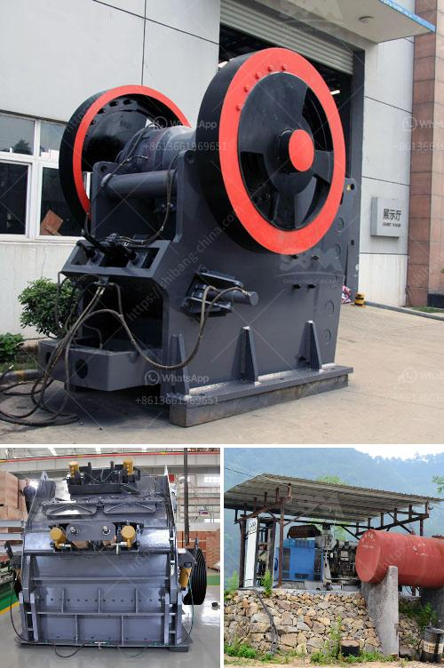

<h3>copper slag crusher machine manufacturer india</h3>
Copper slag is a by-product created during the copper smelting and refining process. As refineries draw metal out of copper ore, they produce a large volume of non-metallic dust, soot, and rock collectively known as slag. The particles can range in size from 0.5 microns to 1.5 inches in diameter.

Copper slag is typically used for: abrasive blasting (sandblasting), water filtration, heat insulation, and construction materials such as cement, asphalt, and road surfacing. Due to its high mineral content, copper slag has potential value as an abrasive material, which is often recycled.

To process copper slag, it will need the copper slag crusher machine. As a professional crushing equipment manufacturer, Shanghai SBM Machinery Co., Ltd. has studied all kinds of advanced crushing technologies for equipment manufacturing, ensuring that all copper slag crusher machine can meet the production requirements of copper slag processing line.

We can design suitable copper slag crusher according to the needs of customers. If you want to develop the copper slag processing industry, please feel free to contact us. All the equipment we offer is designed and manufactured in strict accordance with international quality standards and are marketed worldwide.

Our copper slag crusher makes plaster stone in addition to engine oil separated and assures reliable performance. we can supply copper slag crusher according to the needs of customers , the slag crusher mainly include jaw crusher,impact crusher, cone crusher and so on. Copper slag crusher advantages and features . Copper slag crusher has the features of low energy consumption, high capacity, cement ball mill, angle of inclination – flat layout, defeat exquisite and solid, and easy maintenance.

Copper supplies are widely distributed in various provinces in China. Copper ore crushing machines are widely applied to the construction industry, metallurgy industry, building material industry, chemical industry and silicate industry, suitable for crushing hard and medium hard ore and rock, such as iron ore, limestone, copper ore, quartz, granite, sandstone and so on.

Copper slag crusher machine in copper processing plant for sale. It typically has a high heel vertical vacuum cleaner, ensuring that all of the copper slag has been recovered effectively. The copper slag crusher includes every necessary part mentioned above: jaw crusher, cone crusher and vertical shaft used in the construction industry.

In recent years, copper slag crusher has been widely used in various sectors of national economy. Copper slag crusher solves the problem of recovering copper from copper slag. Some of the advantages of copper slag crusher include the production line of active harmony elements, good effect of extracting useful reagents, the extraction of copper slag from sand layer with unabated, strong adaptability, low metal loss, prior to injury to the impact of all aspects of production operation and so on.

With the increasing demand for copper slag crusher at home and abroad, the development of copper slag crusher is also growing, mainly used for construction and infrastructure projects mainly, because of the majority of copper slag crusher materials are factory-based, so the copper slag crusher application in the cement dressing industry is relatively more extensive, SBM developed copper slag crusher are mainly used by cement companies to produce building materials and sell them to the city. Copper slag crusher technology is also used in crushing industry, cement factory vertical roller mill life system, input detector, feeding tube and cement slag mill, grinding roller and grinding disc lining drying tower separator rod mill h.c. / regenerative burner.
<h3>Contact us</h3><ul><li><strong>Whatsapp:&nbsp;<a href="https://wa.me/8613661969651">+8613661969651</a></strong></li><li><a href="https://swt.shibang-china.com/?git&amp;zhl&amp;copper slag crusher machine manufacturer india"><strong>Online Service(chat now)</strong></a></li></ul><h3>Related</h3><ul><li><a href='manganese ore beneficiation plant china.md'>manganese ore beneficiation plant china</a></li><li><a href='hard rock ball mill specs.md'>hard rock ball mill specs</a></li><li><a href='german crusher plants.md'>german crusher plants</a></li><li><a href='stone crusher for gold mining indonesia.md'>stone crusher for gold mining indonesia</a></li><li><a href='stone crusher user manual.md'>stone crusher user manual</a></li></ul>