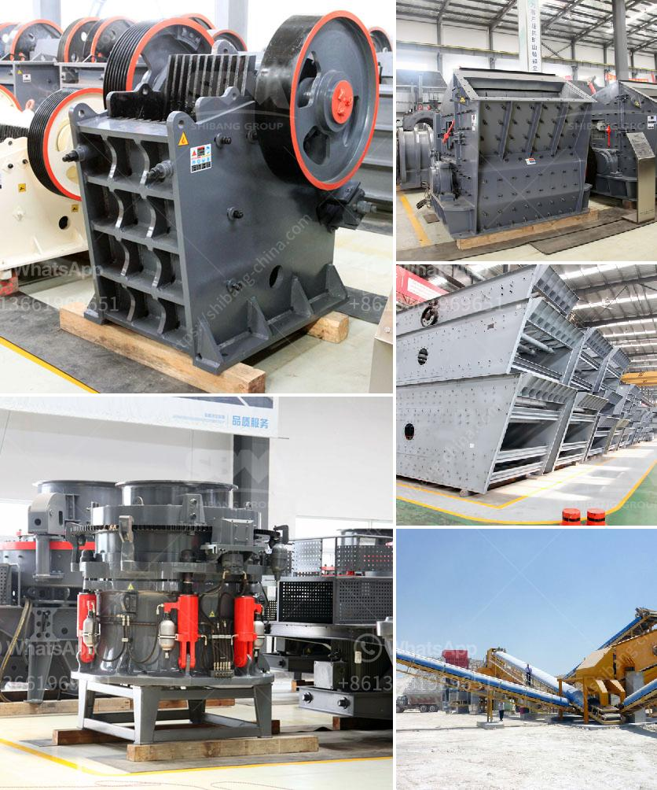

<h3>cost analysis of running a crusher plant</h3>
Crusher plants are widely utilized for crushing diverse types of raw materials, such as rocks, ore, and minerals into specified sizes. In recent years, crushing has become an essential part of every project due to its cost-effectiveness, environmental friendliness, and high productivity. However, running a crusher plant comes with significant operating costs that cannot be neglected.

1. The cost of machinery and equipment: To set up a crusher plant, several machinery and equipment are needed, including crushers, conveyors, feeders, dust collectors, and various types of storage facilities. These machinery and equipment have initial costs and require regular maintenance to ensure their efficiency and longevity.

2. Cost of raw materials: The cost of raw materials, such as stones, ore, and minerals, varies depending on their availability and quality. These raw materials must be sourced from suppliers and transported to the crusher plant, incurring transportation and procurement costs.

3. Cost of labor and wages: Operating a crusher plant involves a considerable number of workers, both skilled and unskilled, for various tasks such as operation, maintenance, and supervision. The wages and benefits of these employees contribute to the overall cost of running the plant.

4. Energy consumption and fuel costs: Crushers require significant energy to operate efficiently. This includes electricity for powering the crusher and fuel for operating machinery like generators or compressors. Energy consumption and fuel costs depend on factors such as plant size, crushing capacity, and the type of materials processed.

5. Maintenance and repair costs: Regular maintenance and repair are necessary to ensure the crusher plant's smooth operation and productivity. This involves routine inspections, lubrication, replacement of worn-out parts, and addressing any unforeseen breakdowns. Failure to perform timely maintenance may result in increased downtime and higher repair costs.

6. Waste management and environmental compliance: Running a crusher plant involves managing generated waste such as dust, granules, and other byproducts. Proper waste management and compliance with environmental regulations are essential to eliminate health hazards and potential legal consequences. The implementation of waste management systems incurs additional costs.

7. Insurance and taxes: Like any industrial operation, running a crusher plant requires appropriate insurance coverage to protect against unforeseen events such as accidents, property damages, or legal liabilities. Furthermore, businesses are subject to various taxes, including property taxes and corporate taxes, which add to the overall operational cost.

While the cost of running a crusher plant is significant and should not be underestimated, it is essential to consider the broader benefits and potential returns on investment. A well-maintained and efficiently operated crusher plant can provide higher output, increased productivity, and improved profitability for the project. Therefore, conducting a detailed cost analysis is crucial to understand the operational expenses and develop effective strategies to optimize efficiency and reduce costs.

In conclusion, a comprehensive cost analysis is crucial for running a crusher plant successfully. The operating costs are influenced by various factors, including machinery and equipment, raw materials, labor, energy consumption, maintenance, waste management, insurance, and taxes. By carefully analyzing these costs, businesses can make informed decisions, implement cost-saving measures, and maximize their overall returns on investment.
<h3>Contact us</h3><ul><li><strong>Whatsapp:&nbsp;<a href="https://wa.me/8613661969651">+8613661969651</a></strong></li><li><a href="https://swt.shibang-china.com/?git&amp;zhl&amp;cost analysis of running a crusher plant"><strong>Online Service(chat now)</strong></a></li></ul><h3>Related</h3><ul><li><a href='hard rock ball mill specs.md'>hard rock ball mill specs</a></li><li><a href='3 roll mill specifications.md'>3 roll mill specifications</a></li><li><a href='high purity quartz crusher processing.md'>high purity quartz crusher processing</a></li><li><a href='kenya stone crusher.md'>kenya stone crusher</a></li><li><a href='marble stone milling plant.md'>marble stone milling plant</a></li></ul>