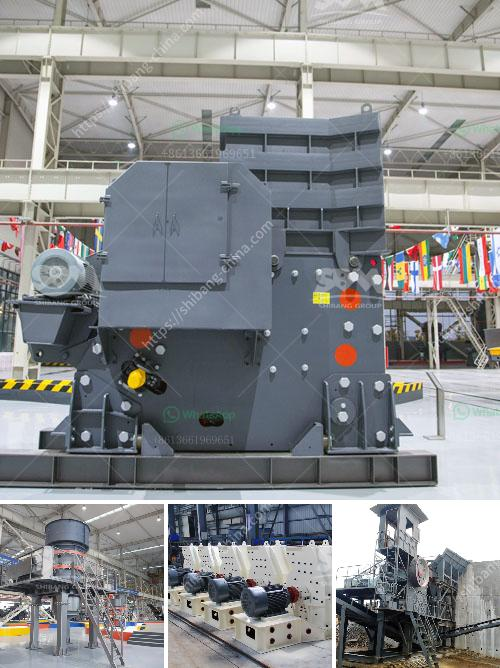

<h3>cost of 500 tonnes per day cement plant ecuador</h3>
Building a cement plant is a significant investment that requires careful planning and consideration. In Ecuador, the construction industry is booming, and the demand for cement is on the rise. Thus, establishing a cement plant can be a lucrative opportunity for entrepreneurs and investors. However, before embarking on such a venture, one must thoroughly understand the costs involved in setting up and operating a cement plant. In this article, we will explore the cost estimate of a 500 tonnes per day cement plant in Ecuador.

To accurately determine the cost of a cement plant, one must consider several key factors. The size of the plant, the production capacity, and the location all influence the overall cost. For our analysis, we will consider a mid-sized plant with a daily production capacity of 500 tonnes.

The primary cost to consider is the capital investment required for infrastructure and machinery. A 500 tonnes per day cement plant would require a significant financial commitment to acquire land, construct the factory, install machinery, and fund other related expenses. Based on industry estimates, the capital investment for such a project can range between $50-100 million USD.

In addition to the initial capital investment, there are ongoing operational costs associated with running a cement plant. These costs typically include those related to raw material procurement, labor, maintenance, and utilities. The cost of raw materials, such as limestone, clay, and gypsum, can vary depending on availability and location. Labor costs in Ecuador are relatively competitive compared to other countries, but they still represent a significant portion of operational expenses. Maintenance costs are essential, as a well-maintained plant ensures smooth operations and extends the lifespan of machinery. Finally, utilities, including electricity and water, are necessary for the production process, and their costs should also be considered.

Furthermore, environmental regulations are becoming increasingly stringent worldwide, and Ecuador is no exception. A cement plant must comply with these regulations, which often entail additional costs. Implementing pollution control measures, waste management systems, and adopting sustainable practices may require significant investments, impacting the overall cost of the plant.

Additionally, it is crucial to conduct a thorough feasibility study to identify potential risks and challenges. Unforeseen circumstances, such as delays in construction, changes in government policies or market conditions, can adversely affect project timelines and costs. Therefore, having a contingency budget is essential to mitigate unforeseen obstacles that may arise during the construction and operation phases.

Lastly, financing options should also be considered. Raising substantial capital for the project may require a combination of equity, debt, or external funding, and this must be factored into the overall cost analysis.

In conclusion, establishing a 500 tonnes per day cement plant in Ecuador is a substantial investment that requires careful assessment of various cost factors. The capital investment for infrastructure and machinery, ongoing operational costs, environmental compliance expenses, and potential risks must all be taken into account. Conducting a comprehensive feasibility study and securing appropriate financing are crucial steps to ensure the project's success. Despite the considerable costs involved, the demand for cement in Ecuador presents a promising opportunity for those willing to invest in the construction industry.
<h3>Contact us</h3><ul><li><strong>Whatsapp:&nbsp;<a href="https://wa.me/8613661969651">+8613661969651</a></strong></li><li><a href="https://swt.shibang-china.com/?git&amp;zhl&amp;cost of 500 tonnes per day cement plant ecuador"><strong>Online Service(chat now)</strong></a></li></ul><h3>Related</h3><ul><li><a href='business proposal sample for mobile crusher.md'>business proposal sample for mobile crusher</a></li><li><a href='stone crusher machine sale nederland.md'>stone crusher machine sale nederland</a></li><li><a href='brick machine manufacturers south africa.md'>brick machine manufacturers south africa</a></li><li><a href='dry wash prospecting unit for sale western philippines.md'>dry wash prospecting unit for sale western philippines</a></li><li><a href='slag crusher cost.md'>slag crusher cost</a></li></ul>