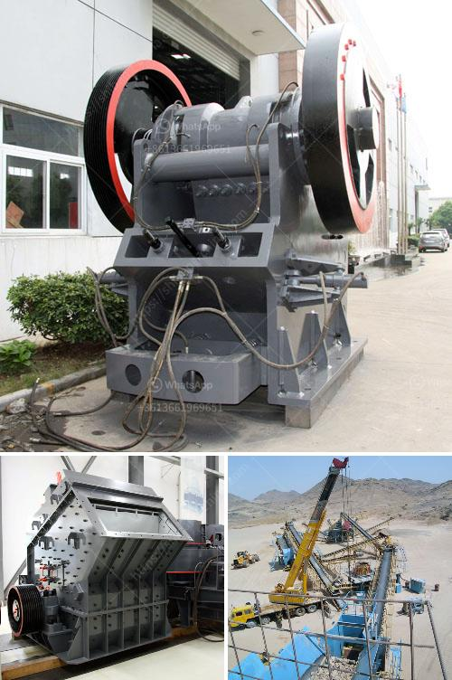

<h3>cost of building a recycling plant in india</h3>
India, with its rapidly growing population and rising consumerism, faces a colossal waste management challenge. To tackle this issue and promote a sustainable future, the establishment of recycling plants is of utmost importance. However, building such facilities involves various factors that contribute to the overall cost. In this article, we will delve into the cost implications of constructing a recycling plant in India.

Constructing a recycling plant requires a significant investment in infrastructure, including buildings, roads, utilities, and waste collection systems. The cost of acquiring land for the facility also needs to be considered. The location of the plant can impact the overall expenses, with proximity to waste sources and transportation networks being crucial factors.

Recycling plants require advanced machinery and equipment to efficiently process and sort different types of waste materials. The cost of procuring high-quality equipment like shredders, balers, conveyors, and sorting machines can be substantial. Additionally, incorporating technological advancements for efficient recycling processes also contributes to the overall expenditure.

Recycling plants demand skilled labor to operate machinery, manage waste streams, and ensure effective recycling processes. The hiring and training of employees impact the overall costs. Collaboration with local institutions and vocational training centers can help in building a skilled workforce while reducing long-term labor costs.

The construction and operation of recycling plants in India must comply with various environmental regulations and obtain necessary permits. Costs associated with obtaining environmental clearances, licenses, and adhering to stringent pollution control measures add to the overall investment.

To enhance the efficiency and effectiveness of recycling, advanced waste treatment technologies such as composting, anaerobic digestion, or energy recovery can be incorporated. These technologies require additional infrastructure and operational costs. However, they can offset expenses in the long run by generating revenue through by-products like compost, biogas, or electricity.

Recycling plants require a robust and efficient transportation system to collect waste from various sources and deliver processed materials to relevant industries. The cost of establishing transportation networks, including vehicles and infrastructure, should be considered to ensure smooth operations.

Once the recycling plant is operational, ongoing maintenance costs, labor, energy consumption, and waste management costs need to be factored into the overall expenses. Regular repairs and upgrades are crucial to ensure optimal plant performance, sustainability practices, and the longevity of the facility.

Building a recycling plant in India is a commendable investment for a sustainable future. While the initial costs may seem substantial, the benefits are far-reaching. Recycling plants help protect the environment, reduce landfill waste, promote resource conservation, and create employment opportunities. Additionally, by embracing the circular economy model, the plant can generate returns through the sale of recycled materials and by-products. It is crucial for stakeholders, both public and private, to collaborate and invest in recycling infrastructure to ensure a greener and cleaner India for generations to come.
<h3>Contact us</h3><ul><li><strong>Whatsapp:&nbsp;<a href="https://wa.me/8613661969651">+8613661969651</a></strong></li><li><a href="https://swt.shibang-china.com/?git&amp;zhl&amp;cost of building a recycling plant in india"><strong>Online Service(chat now)</strong></a></li></ul><h3>Related</h3><ul><li><a href='limestone primary crushing plant.md'>limestone primary crushing plant</a></li><li><a href='ykn vibrating screen price.md'>ykn vibrating screen price</a></li><li><a href='japan directory of mobile crushing plant.md'>japan directory of mobile crushing plant</a></li><li><a href='zimbabwe hammer mills.md'>zimbabwe hammer mills</a></li><li><a href='concrete crusher prices.md'>concrete crusher prices</a></li></ul>