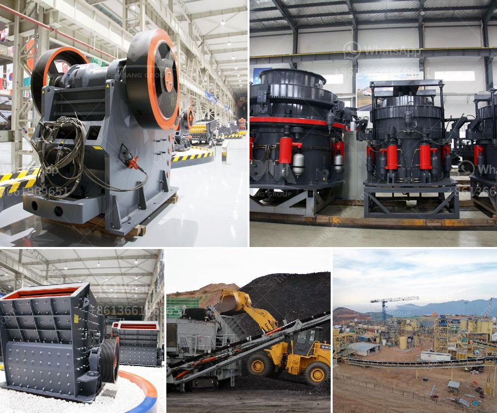

<h3>cost of cement clinker grinding unit</h3>
The cost of cement clinker grinding unit refers to the amount of money invested in the grinding machine for the cement manufacturing process. It is an important measure to evaluate the efficiency of cement clinker grinding unit.

Every year, Zenith would spend up to 5% of total capital investment on Research and Development(R&D) to ensure that each product is manufactured with advanced technology and high quality standards. The clinker grinding unit produced by Zenith through technology innovation is the lowest power consumption among the clinker grinding units in the industry, reducing the investment cost of customers.

In terms of the cost of cement clinker grinding unit, the production cost of clinker is directly affected by its specific grinability factor. The grindability of clinker is a measure of its hardness and is a key factor determining the production cost of clinker grinding unit. The factors that influence the grindability of clinker include the mineral composition, grindability of the main mineral phases, particle size distribution of the clinker, and the temperature and humidity conditions during grinding.

The investment cost of a cement clinker grinding unit is determined by factors such as the production capacity of the grinding machine, the required fineness of the finished product, the particle size of the grinding material, the wear resistance of the grinding balls, the grinding time, and the energy consumption, among others. Zenith provides customized services according to each customer's specific needs and production requirements to help customers control costs and maximize profits.

In summary, the cost of cement clinker grinding unit is influenced by various factors, including the grindability of clinker, the production capacity of the grinding machine, the required fineness, and the specific needs of customers. Zenith, as a leading manufacturer in the cement industry, provides high-quality equipment and tailored solutions to help customers reduce costs and improve efficiency in cement production.
<h3>Contact us</h3><ul><li><strong>Whatsapp:&nbsp;<a href="https://wa.me/8613661969651">+8613661969651</a></strong></li><li><a href="https://swt.shibang-china.com/?git&amp;zhl&amp;cost of cement clinker grinding unit"><strong>Online Service(chat now)</strong></a></li></ul><h3>Related</h3><ul><li><a href='limestone ball mill.md'>limestone ball mill</a></li><li><a href='iron processing equipment price.md'>iron processing equipment price</a></li><li><a href='cone crusher company.md'>cone crusher company</a></li><li><a href='the world largest mobile crusher.md'>the world largest mobile crusher</a></li><li><a href='quarry machine in nigeria.md'>quarry machine in nigeria</a></li></ul>