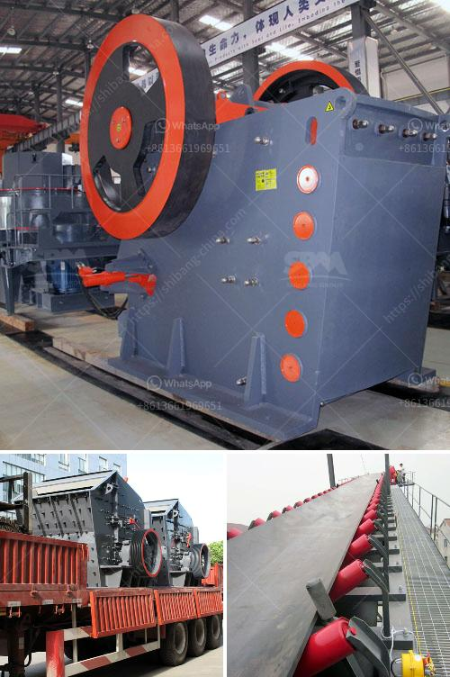

<h3>cost of cinder powder in bangalore</h3>
Cinder powder, also known as fly ash, is becoming an increasingly popular construction material in Bangalore, India. As the city experiences rapid urbanization and development, the demand for affordable and sustainable building materials is on the rise. Cinder powder is an excellent alternative to traditional cement, as it is derived from the ash produced during the combustion of coal in thermal power plants.

One of the main advantages of using cinder powder in construction is its cost-effectiveness. Traditional cement prices have been steadily rising in recent years, making it less accessible for many builders and contractors in Bangalore. In contrast, the cost of cinder powder is relatively lower due to its abundance as a byproduct of coal power generation.

The price of cinder powder in Bangalore can vary depending on several factors, including the specific grade and quality of the product. On average, the cost of cinder powder ranges from INR 2,000 to INR 4,000 per metric ton. However, it is important to note that these prices are subject to market fluctuations and can vary over time.

Furthermore, due to its growing popularity and demand, many suppliers in Bangalore offer bulk discounts for large-scale construction projects. This makes cinder powder an even more affordable option for builders looking to save on costs without compromising the quality of their structures.

Apart from its cost-effectiveness, cinder powder also offers several other benefits. It is lightweight, easy to handle, and has excellent thermal and sound insulation properties. Moreover, its use promotes sustainability by reducing the carbon footprint associated with traditional cement production.

In conclusion, the cost of cinder powder in Bangalore presents an affordable alternative to traditional cement in the construction industry. With its lower prices, builders and contractors can save on construction costs without compromising on quality. As the city continues to develop and urbanize, cinder powder's popularity is likely to increase, contributing to a more sustainable and cost-effective construction sector in Bangalore.
<h3>Contact us</h3><ul><li><strong>Whatsapp:&nbsp;<a href="https://wa.me/8613661969651">+8613661969651</a></strong></li><li><a href="https://swt.shibang-china.com/?git&amp;zhl&amp;cost of cinder powder in bangalore"><strong>Online Service(chat now)</strong></a></li></ul><h3>Related</h3><ul><li><a href='berat mobile screen mobile crusher.md'>berat mobile screen mobile crusher</a></li><li><a href='sell jaw crusher for turkey.md'>sell jaw crusher for turkey</a></li><li><a href='stone crusher machine from uk.md'>stone crusher machine from uk</a></li><li><a href='industrial vibrating feeders.md'>industrial vibrating feeders</a></li><li><a href='stone crusher plant information.md'>stone crusher plant information</a></li></ul>