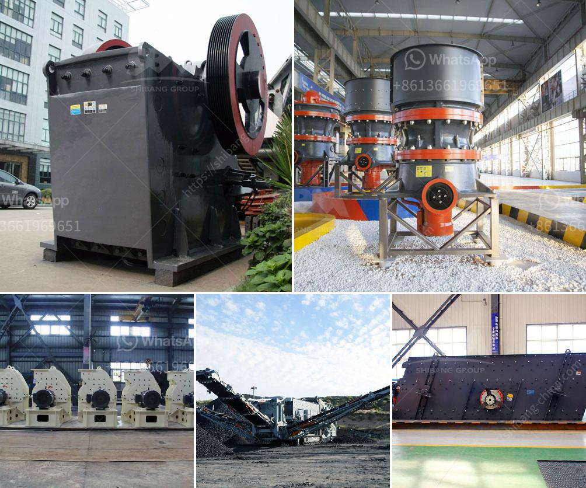

<h3>cost of dolomite milling machine in india</h3>
The cost of dolomite milling machine in India is an important factor when it comes to purchasing a dolomite milling machine in India. Various factors determine the cost of machines like the quality, durability, and model. In today’s article, let's take a closer look at the cost of dolomite milling machine in India with 300-500 words.

Dolomite is a natural mineral that has a significant amount of magnesium. It is commonly used in the construction industry as a building material and can also be used as a fertilizer due to its high magnesium content, promoting plant growth. Dolomite needs to be milled before it can be used in various products, such as glass, ceramics, and steel.

When it comes to dolomite milling machines, several factors affect their cost in India. First and foremost, the quality of the machine plays a crucial role. High-quality machines tend to be more expensive due to the use of premium materials, advanced manufacturing techniques, and better overall performance. These machines are built to last and deliver efficient results, making them a worthy investment for industries that require dolomite milling regularly.

Another factor that affects the cost of dolomite milling machines in India is the model of the machine. There are various models available in the market, each with its own specifications and features. Higher-end models with advanced functionalities tend to come at a higher cost, while basic models that offer limited features may be more budget-friendly. The choice of the model depends on the specific requirements and budget of the buyer.

The size of the dolomite milling machine also affects its cost. Machines with larger capacities and higher output rates tend to be more expensive. These machines are capable of processing a substantial amount of dolomite in a shorter period, making them ideal for industries with high production demands. On the other hand, smaller machines are more affordable and suitable for smaller-scale operations.

The brand of the dolomite milling machine also plays a role in determining its cost. Established and reputable brands may charge a premium for their machines due to their brand value and market reputation. However, opting for a well-known brand can provide assurance regarding the machine’s quality and after-sales service.

Apart from the initial cost of purchasing a dolomite milling machine in India, there are also maintenance and operational costs to consider. Regular maintenance, such as replacing worn-out parts and lubrication, is crucial to ensure the smooth functioning of the machine. Additionally, electricity consumption and labor costs should be factored in when calculating the overall cost of operation.

In conclusion, the cost of dolomite milling machines in India varies depending on various factors like the quality, model, size, and brand. It is essential to consider these factors and conduct thorough research before making a purchase decision. Investing in a high-quality machine will ensure reliability, durability, and efficient dolomite milling, leading to higher productivity and profitability in the long run.
<h3>Contact us</h3><ul><li><strong>Whatsapp:&nbsp;<a href="https://wa.me/8613661969651">+8613661969651</a></strong></li><li><a href="https://swt.shibang-china.com/?git&amp;zhl&amp;cost of dolomite milling machine in india"><strong>Online Service(chat now)</strong></a></li></ul><h3>Related</h3><ul><li><a href='cost of gold bow mill for sale in south africa.md'>cost of gold bow mill for sale in south africa</a></li><li><a href='coal crusher and screen plant for sale.md'>coal crusher and screen plant for sale</a></li><li><a href='what is difference between crusher and mills.md'>what is difference between crusher and mills</a></li><li><a href='stone crusher rubber conveyor.md'>stone crusher rubber conveyor</a></li><li><a href='conveyor belts in opracion.md'>conveyor belts in opracion</a></li></ul>