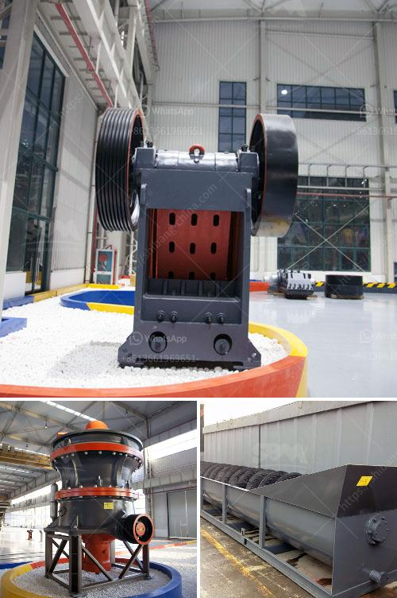

<h3>cost of gold bow mill for sale in south africa</h3>
South Africa is renowned for its rich reserves of gold, contributing to a significant proportion of global production and earnings. However, the oozing bounty is by no means easily extracted. To extract gold from the ore, a significant amount of machinery is required, including mills specifically designed to crush and grind the precious metal-bearing material. In this article, we will explore the cost of gold bow mills for sale in South Africa.

Gold extraction is a complex process that involves several stages. After the initial extraction from the mine, the ore goes through various crushing, grinding, and ball-milling processes to achieve the desired particle size and increase the overall surface area for gold recovery. Bow mills are crucial in this stage of the extraction process, as they effectively pulverize the gold-bearing rock into a fine powder.

The cost of gold bow mills is influenced by the manufacturing process and the materials used. Manufacturers must invest heavily in equipment, labor, and technology to produce reliable and efficient mills. Additionally, the sourcing and quality of materials, such as steel, impact the overall cost. High-quality materials ensure longevity and reduce maintenance expenses.

Bow mills require substantial energy consumption to operate efficiently. The electricity cost of running these machines can be significant, which, in turn, impacts the pricing. With South Africa struggling to stabilize its power grid and facing occasional blackouts, gold mining operations have to consider backup power supply options, further increasing costs.

Human labor is essential for the operation and maintenance of gold bow mills. Technicians, machine operators, and maintenance personnel all contribute to the cost, as their salaries and training requirements are necessary expenditures. The skilled workforce required to handle these specialized machines often requires higher wages, contributing to overall labor expenses.

The cost of transporting and installing bow mills in South Africa also influences the final price. These machines are typically large and heavy, requiring specialized equipment and expertise for delivery and assembly. The transportation costs are likely to vary depending on the distance to the mining site.

The cost of gold bow mills for sale in South Africa is influenced by various factors, including manufacturing and material expenses, energy consumption, labor expenses, and transport and installation costs. The demand for these machines remains high due to the country's significant gold reserves and its crucial role in the global gold mining industry. Gold miners must carefully consider these factors and compare prices from different suppliers to make informed purchase decisions that strike a balance between quality, cost, and overall operational requirements.
<h3>Contact us</h3><ul><li><strong>Whatsapp:&nbsp;<a href="https://wa.me/8613661969651">+8613661969651</a></strong></li><li><a href="https://swt.shibang-china.com/?git&amp;zhl&amp;cost of gold bow mill for sale in south africa"><strong>Online Service(chat now)</strong></a></li></ul><h3>Related</h3><ul><li><a href='flow diagram by gypsum process.md'>flow diagram by gypsum process</a></li><li><a href='impact crusher hammer mill.md'>impact crusher hammer mill</a></li><li><a href='zimbabwe hammer mills.md'>zimbabwe hammer mills</a></li><li><a href='mobile crushing and screening to hire south africa.md'>mobile crushing and screening to hire south africa</a></li><li><a href='cost sand dryer in keralan.md'>cost sand dryer in keralan</a></li></ul>