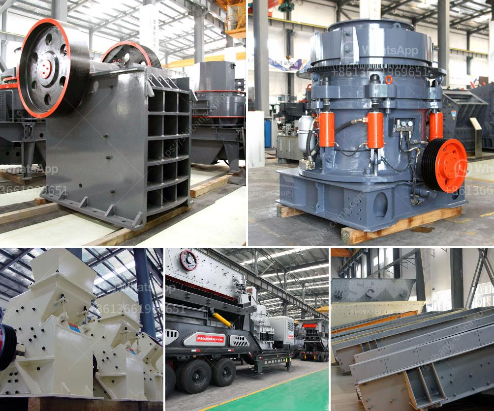

<h3>cost of malaysia mobile crusher in india</h3>
The mobile crusher industry in India is witnessing a boom as the demand for crushing materials is increasing rapidly. This is attributed to the growth in the infrastructure development projects in the country. As a result, many companies are entering the market to meet the rising demand.

One such company is Malaysia Mobile Crusher, which has recently ventured into the Indian market. They offer various models of mobile crushers that can cater to different crushing needs. The cost of these crushers varies depending on the model and features. However, the cost of a mobile crusher from Malaysia Mobile Crusher is comparatively lower than other brands.

The low cost factor is mainly due to the lower production and labor costs in Malaysia. The country boasts a well-developed manufacturing industry, which allows for the production of high-quality crushers at a lower cost. Additionally, the cost of raw materials and components used in the manufacturing process is also more affordable in Malaysia.

India, on the other hand, is witnessing a surge in the cost of production due to factors like rising labor costs, increasing raw material prices, and higher electricity expenses. This, in turn, affects the pricing of mobile crushers offered by Indian manufacturers, making them more expensive compared to their Malaysian counterparts.

The lower cost of Malaysia Mobile Crushers makes them an attractive option for Indian buyers who are looking for affordable yet efficient crushing solutions. These crushers are equipped with advanced technologies and are capable of handling various types of materials, making them suitable for a wide range of applications.

In conclusion, the cost of Malaysia Mobile Crushers in India is relatively lower compared to Indian manufacturers. This factor, coupled with their advanced technologies and versatility, makes them an excellent choice for Indian buyers. As the demand for mobile crushers continues to grow in India, it is expected that the market share of Malaysia Mobile Crushers will increase further in the coming years.
<h3>Contact us</h3><ul><li><strong>Whatsapp:&nbsp;<a href="https://wa.me/8613661969651">+8613661969651</a></strong></li><li><a href="https://swt.shibang-china.com/?git&amp;zhl&amp;cost of malaysia mobile crusher in india"><strong>Online Service(chat now)</strong></a></li></ul><h3>Related</h3><ul><li><a href='japan used mine equipment price.md'>japan used mine equipment price</a></li><li><a href='kenya mobile crusher philippines.md'>kenya mobile crusher philippines</a></li><li><a href='ton per hour hammer mill grinding mill china.md'>ton per hour hammer mill grinding mill china</a></li><li><a href='mini mill 12x20 jaw crusher.md'>mini mill 12x20 jaw crusher</a></li><li><a href='copper processing plant.md'>copper processing plant</a></li></ul>