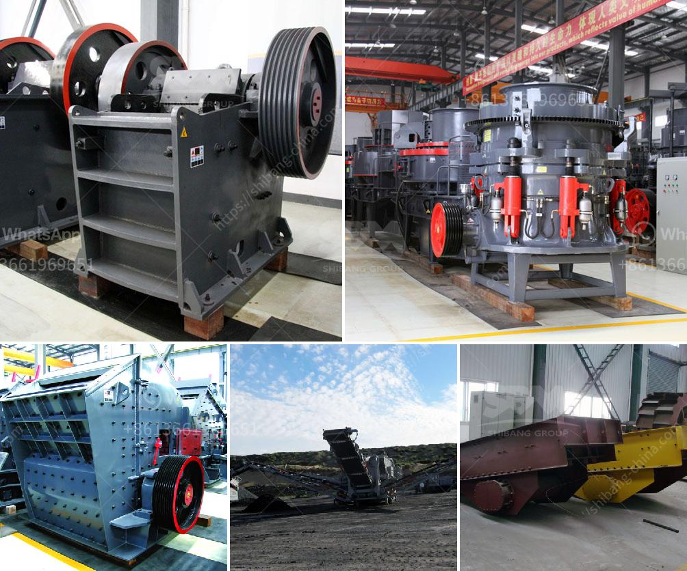

<h3>cost of roller crusher</h3>
Roller crushers, also known as roll crushers, are used primarily for crushing friable materials such as coal, limestone, clay, mineral, and brick. They are an essential piece of machinery for various industries, including mining, metallurgy, building materials, and chemical engineering. But what exactly is the cost of a roller crusher? In this article, we will delve into the different factors that determine the cost of a roller crusher.

One of the key determinants of the cost of a roller crusher is its size and capacity. Roller crushers are available in various sizes, ranging from small machines that have a capacity of a few tons per hour to large-scale machines with a capacity of hundreds of tons per hour. The larger the size and capacity of the crusher, the higher the cost. Additionally, the size of the rollers themselves also affects the cost. Rollers with larger diameters and widths are more expensive to manufacture, thus increasing the overall cost of the crusher.

Another factor that impacts the cost of a roller crusher is the technology and features incorporated into the machine. More advanced roller crushers typically come with additional features such as automated controls, adjustable settings, and enhanced safety mechanisms. These advanced features increase the complexity of the machine, thus driving up the cost. However, it is important to note that these additional features can enhance the efficiency and productivity of the crusher, resulting in long-term cost savings.

The type of roller crusher also influences its cost. There are various types of roller crushers available, including single roll crushers, double roll crushers, triple roll crushers, and quad roll crushers. Each type has its unique advantages and specifications, and the cost varies accordingly. For example, double roll crushers are generally more expensive than single roll crushers due to their higher production capacities and more complex design.

Furthermore, the cost of a roller crusher can also be influenced by the manufacturer and location. Certain manufacturers may charge higher prices based on their brand reputation or the materials used in the construction of the crusher. Additionally, local taxes, import/export duties, and transportation costs can impact the final price of the crusher.

It is worth noting that the cost of a roller crusher does not solely depend on its initial purchase price. There are additional costs associated with the maintenance and operation of the crusher. Regular maintenance, replacement of wear parts, and lubrication are essential to ensure the longevity and optimal performance of the machine. Ignoring or neglecting these maintenance requirements can lead to increased downtime, repair costs, and decreased productivity.

In conclusion, the cost of a roller crusher is determined by various factors, including the size, capacity, technology, type, manufacturer, and location. It is important for prospective buyers to carefully consider their specific requirements and budget before investing in a roller crusher. Additionally, ongoing maintenance and operational costs should be taken into account to ensure the long-term viability and cost-effectiveness of the machine.
<h3>Contact us</h3><ul><li><strong>Whatsapp:&nbsp;<a href="https://wa.me/8613661969651">+8613661969651</a></strong></li><li><a href="https://swt.shibang-china.com/?git&amp;zhl&amp;cost of roller crusher"><strong>Online Service(chat now)</strong></a></li></ul><h3>Related</h3><ul><li><a href='crushing b vsi crusher.md'>crushing b vsi crusher</a></li><li><a href='stone crusher machine sale germany.md'>stone crusher machine sale germany</a></li><li><a href='used coal washing plants for sale in pakistan.md'>used coal washing plants for sale in pakistan</a></li><li><a href='used mini grinding plant india sale.md'>used mini grinding plant india sale</a></li><li><a href='stone crusher machine pr ice in nepal.md'>stone crusher machine pr ice in nepal</a></li></ul>