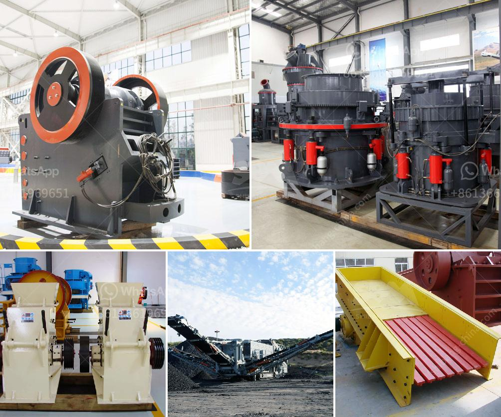

<h3>cost of set up mini cement plant in india</h3>
India is the second-largest producer of cement in the world, making it an attractive investment opportunity for entrepreneurs looking to set up a mini cement plant. However, understanding the costs involved in establishing a mini cement plant can be quite daunting. In this article, we will break down the estimated cost of setting up a mini cement plant in India.

The cost of setting up a mini cement plant varies depending on the location, size, and capacity of the plant. As a rough estimate, a mini cement plant can be set up with a budget of around INR 25 to 30 crores (USD 3.5 to 4.2 million). This includes acquiring land, machinery, and licenses, as well as other necessary expenses.

Land acquisition is an essential part of setting up a cement plant. The cost of land can vary significantly depending on the location, with prices being higher in metropolitan areas compared to rural areas. On average, the cost of acquiring land for a mini cement plant ranges from INR 5 to 10 crores (USD 700,000 to 1.4 million).

Machinery is another significant cost associated with setting up a mini cement plant. This includes purchasing and installing equipment such as crushers, mixers, conveyors, and other miscellaneous machinery required for the production process. The cost of machinery can range from INR 4 to 6 crores (USD 560,000 to 840,000), depending on the capacity and quality of the equipment.

Licenses and permits are another crucial aspect of setting up a mini cement plant. This includes obtaining necessary approvals from local authorities, environmental clearances, and licenses for procuring raw materials. The costs associated with acquiring licenses and permits can vary, but on average, it can range from INR 2 to 4 crores (USD 280,000 to 560,000).

Other miscellaneous expenses include hiring skilled and unskilled labor, raw material procurement, utilities, transportation, marketing, and administrative costs. These expenses can add up to approximately INR 14 to 20 crores (USD 2 to 2.8 million).

It is important to note that these cost estimates are approximate and can vary depending on various factors. It is advisable to conduct a detailed feasibility study and consult with industry experts to get a precise estimate before setting up a mini cement plant in India.

In conclusion, while the cost of setting up a mini cement plant in India can be significant, the potential returns on investment make it an appealing venture. By considering factors such as land acquisition, machinery, licenses, and other miscellaneous expenses, entrepreneurs can have a clearer understanding of the estimated costs involved in establishing a mini cement plant.
<h3>Contact us</h3><ul><li><strong>Whatsapp:&nbsp;<a href="https://wa.me/8613661969651">+8613661969651</a></strong></li><li><a href="https://swt.shibang-china.com/?git&amp;zhl&amp;cost of set up mini cement plant in india"><strong>Online Service(chat now)</strong></a></li></ul><h3>Related</h3><ul><li><a href='price of stone crusher capacitytons an hour.md'>price of stone crusher capacitytons an hour</a></li><li><a href='marble crusher machine philippines.md'>marble crusher machine philippines</a></li><li><a href='ball mill suppliers.md'>ball mill suppliers</a></li><li><a href='costs for a stone crusher plant.md'>costs for a stone crusher plant</a></li><li><a href='vertical roller mill animation gif.md'>vertical roller mill animation gif</a></li></ul>