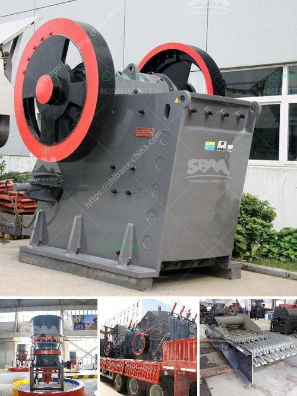

<h3>cost of setting up a production plant for tantalum</h3>
Tantalum, a rare and highly sought-after metal, is widely used in various industries due to its unique properties. It is particularly valued for its resistance to corrosion, high melting point, and ability to store electrical charge. As a result, the demand for tantalum has been steadily increasing, leading to a need for more production plants to meet this demand.

Setting up a production plant for tantalum involves numerous considerations, including location, infrastructure, equipment, and labor. These factors play a significant role in determining the overall cost of establishing a plant.

One of the primary considerations is the choice of location. The cost of setting up a production plant can vary depending on the region and country where it is located. Factors such as labor costs, taxes, regulations, and availability of raw materials can significantly impact the total cost. Additionally, proximity to transportation hubs and markets is also crucial for efficient distribution.

Infrastructure is another crucial element in the cost of setting up a production plant. This includes constructing necessary buildings, utility connections, and other facilities required for smooth operations. The cost of acquiring land and obtaining necessary permits and licenses must also be taken into account. Developing adequate infrastructure can consume a significant portion of the initial investment.

The cost of equipment is another major factor in setting up a tantalum production plant. Equipment used in the extraction, purification, and refining processes can be quite expensive. Sophisticated machinery is required to handle the unique properties of tantalum effectively. The cost of acquiring such equipment can range from hundreds of thousands to millions of dollars, depending on the scale and complexity of the plant.

Labor costs also play a significant role in determining the overall expense of setting up a production plant. Skilled technicians and engineers are essential for operating and maintaining the plant efficiently. The availability of a skilled workforce in the chosen location can impact labor costs. Additionally, training programs may be necessary to ensure workers have the necessary expertise in tantalum production processes.

Raw materials are a critical component of tantalum production, and their availability and cost must be considered. The cost of purchasing and securing a consistent supply of tantalum ore can substantially impact the final production plant budget. Countries with significant tantalum deposits may offer a cost advantage in terms of proximity and availability.

In conclusion, setting up a production plant for tantalum can involve significant costs. Factors such as location, infrastructure, equipment, labor, and raw material availability must all be carefully considered. The total cost will depend on the scale of the plant, the sophistication of the equipment required, and the specific circumstances of the chosen location. However, with the increasing demand for tantalum, the investment in setting up a production plant can prove to be a lucrative venture in the long run.
<h3>Contact us</h3><ul><li><strong>Whatsapp:&nbsp;<a href="https://wa.me/8613661969651">+8613661969651</a></strong></li><li><a href="https://swt.shibang-china.com/?git&amp;zhl&amp;cost of setting up a production plant for tantalum"><strong>Online Service(chat now)</strong></a></li></ul><h3>Related</h3><ul><li><a href='stone crusher manufacturers in ranchi.md'>stone crusher manufacturers in ranchi</a></li><li><a href='roller mill for dolmite.md'>roller mill for dolmite</a></li><li><a href='cone crusher equipment.md'>cone crusher equipment</a></li><li><a href='black stone crushing thailand.md'>black stone crushing thailand</a></li><li><a href='grinding lm vertical mill.md'>grinding lm vertical mill</a></li></ul>