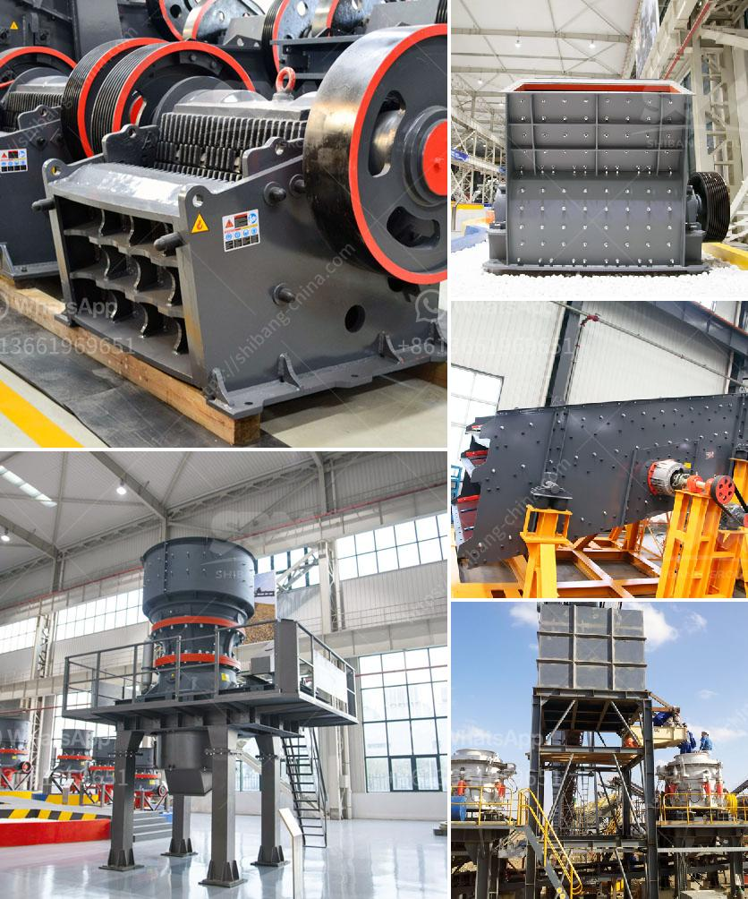

<h3>cost of setting up a stamp mill in zimbabwe</h3>
The recently implemented fiscal policies by the Zimbabwean government have led to an exponential rise in the cost of setting up a stamp mill. Gone are the days when you could just walk into a mining sector showroom and pick up a stamp mill. Nowadays, with the ever-increasing prices of materials and labor, the cost of setting up a stamp mill has become a daunting task for many small-scale miners in Zimbabwe.

A stamp mill is a type of mill machine that crushes material by pounding rather than grinding, either for further processing or for extraction of metallic ores. Breaking down ores by pounding them with heavy stamps was a widely used method in the early years of gold mining in Zimbabwe. This process, called an arrastra, was fairly simple and required only a few basic tools. However, with the decline of easy-to-access gold deposits, miners have had to resort to using more advanced technology.

The cost of setting up a stamp mill has soared in recent years. Stringent regulations, high mining costs, and lack of access to finance are some of the factors that have contributed to this situation. One of the major challenges faced by small-scale miners is the high cost of purchasing and installing stamp mills.

1. Capital Investment: Setting up a stamp mill requires a significant initial investment. The cost of purchasing the mill machinery, including the stamps, crushers, and other equipment, can be quite expensive. Additionally, one needs to consider the cost of transportation, import duties, and taxes when purchasing the machinery from overseas.

2. Labor Costs: Staffing the stamp mill operation requires skilled laborers, engineers, and technicians who understand the machinery and can operate it effectively. Paying competitive wages to such personnel can be financially burdensome for small-scale miners.

3. Maintenance and Repair: Like any heavy machinery, stamp mills require regular maintenance and occasional repairs. Ensuring the availability of spare parts and the services of experienced technicians adds to the overall cost.

4. Power Supply: Stamp mills require a consistent power supply to operate efficiently. In Zimbabwe, where power cuts and lack of access to electricity are common issues, miners need to invest in alternative power sources, such as diesel generators or solar power, which further increases the overall setup cost.

5. Regulatory Compliance: Zimbabwe has stringent mining regulations that require miners to obtain various licenses and permits. The process of obtaining these licenses often involves additional costs, including legal fees and administrative charges.

Despite these challenges, setting up a stamp mill can be a lucrative investment for small-scale miners. A well-established stamp mill can process significant amounts of ore, leading to substantial gold production. With gold prices reaching record highs in recent years, the potential for profit is considerable.

To mitigate the high costs, small-scale miners can explore options such as forming cooperatives to share expenses and improve their bargaining power when purchasing machinery. They can also seek financing from government or financial institutions that support small-scale mining ventures.

In conclusion, the cost of setting up a stamp mill in Zimbabwe has increased significantly in recent years due to various factors. These include high capital investment, labor costs, maintenance and repair expenses, power supply challenges, and regulatory compliance costs. Despite these hurdles, setting up a stamp mill can still be a profitable venture for small-scale miners in Zimbabwe. By exploring alternative financing options and collaborating with fellow miners, they can overcome these challenges and tap into the lucrative gold mining industry.
<h3>Contact us</h3><ul><li><strong>Whatsapp:&nbsp;<a href="https://wa.me/8613661969651">+8613661969651</a></strong></li><li><a href="https://swt.shibang-china.com/?git&amp;zhl&amp;cost of setting up a stamp mill in zimbabwe"><strong>Online Service(chat now)</strong></a></li></ul><h3>Related</h3><ul><li><a href='10tph mobile stone crusher with vibrating screen.md'>10tph mobile stone crusher with vibrating screen</a></li><li><a href='ball mill suppliers uk.md'>ball mill suppliers uk</a></li><li><a href='for sale rock crushing plant 150 tons.md'>for sale rock crushing plant 150 tons</a></li><li><a href='japan used rolling mill.md'>japan used rolling mill</a></li><li><a href='vibration ranges for jaw crusher.md'>vibration ranges for jaw crusher</a></li></ul>