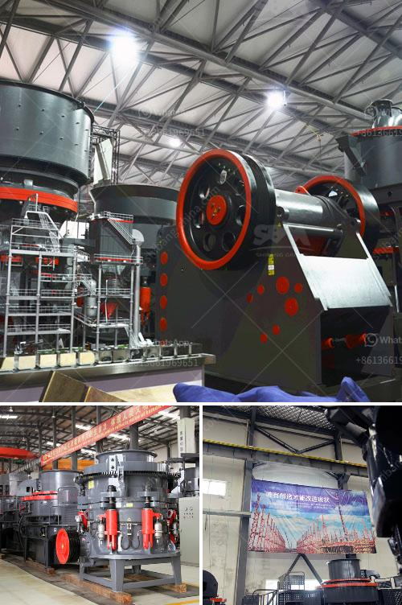

<h3>cost of stone crusher plant in saudi</h3>
The cost of stone crusher plant in Saudi Arabia is primarily based on the factors such as the capacity, raw materials, and the final products. Most importantly, the cost of stone crusher plant is also different depending on the different requirements of different customers.

The key reason why the cost of stone crusher plant is so high is due to the high efficiency and excellent performance of stone crusher plant. In terms of operations, stone crusher plant has a lot of tasks to perform, such as crushing, screening, conveying, and even grinding. With all these tasks involved, it is inevitable for the cost of stone crusher plant to be high.

Another important reason why the cost of stone crusher plant is high is the high cost of raw materials. Most stone crusher plants are located near the mountains where the raw materials are extracted. As a result, transportation costs for delivering these materials can be high.

The cost of stone crusher plant also depends on the number of machines required and their capacities. This means that the more machines and the higher their capacities, the higher the cost of the plant. Furthermore, in order to operate the plant efficiently, a number of support equipment is required. These support equipment include loaders, excavators, crushers, screens, and conveyor belts, which all contribute to the overall cost of the plant.

In addition to the above factors, the cost of stone crusher plant is also influenced by other factors such as the quality of the equipment, fuel consumption, and maintenance costs. High-quality equipment will generally have a higher cost, but it will also ensure better performance and longer lifespan, resulting in lower maintenance costs in the long run. On the other hand, low-quality equipment may have a lower cost initially, but it may result in higher maintenance costs and frequent breakdowns, which can be costly.

Overall, the cost of stone crusher plant in Saudi Arabia is influenced by various factors, such as the capacity, raw materials, and the final products. It is important to choose the right equipment and technology for efficient and cost-effective operation of the plant. Additionally, regular maintenance and proper management of the plant can help minimize the overall cost and maximize the profitability of the operation.
<h3>Contact us</h3><ul><li><strong>Whatsapp:&nbsp;<a href="https://wa.me/8613661969651">+8613661969651</a></strong></li><li><a href="https://swt.shibang-china.com/?git&amp;zhl&amp;cost of stone crusher plant in saudi"><strong>Online Service(chat now)</strong></a></li></ul><h3>Related</h3><ul><li><a href='screw conveyor for sand.md'>screw conveyor for sand</a></li><li><a href='mobile stone crushing plant made in germany.md'>mobile stone crushing plant made in germany</a></li><li><a href='project report granite cutting file.md'>project report granite cutting file</a></li><li><a href='gemstone mining in zambia.md'>gemstone mining in zambia</a></li><li><a href='ball mill operation cost.md'>ball mill operation cost</a></li></ul>