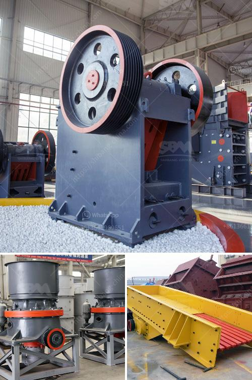

<h3>cost sand dryer in keralan</h3>
In the construction industry, sand plays a crucial role as a key building material. However, the process of drying sand to ensure optimum quality and usability can be a challenging task. Sand dryers are modern equipment widely used in construction sites to efficiently dry sand, ensuring its quality and supporting smooth construction operations. In this article, we will delve into the various aspects involved in the cost of sand dryers in the state of Kerala, India.

There are primarily two types of sand dryers available in the market: rotary sand dryers and fluidized bed dryers. Rotary sand dryers are more commonly used due to their simplicity, efficiency, and cost-effectiveness. However, fluidized bed dryers offer certain advantages such as improved heat transfer, reduced emissions, and higher thermal efficiency.

The cost of sand dryers in Kerala can vary depending on various factors such as their size, capacity, and type. Generally, the cost of rotary sand dryers ranges from INR 5 lakh to INR 20 lakh (approximately $6,700 to $26,800), whereas fluidized bed dryers can cost between INR 15 lakh to INR 50 lakh (approximately $20,000 to $67,000). These costs do not include additional expenses such as installation, transportation, and maintenance.

Apart from the initial investment, it is crucial to consider the operating costs associated with sand dryers. These costs include fuel or electricity consumption, maintenance, and periodic component replacements. Rotary sand dryers typically have lower operating costs compared to fluidized bed dryers due to the simplicity of their design and lower energy requirements.

While considering the cost of sand dryers, it is essential to assess their efficiency and productivity. Rotary sand dryers are known for their excellent drying efficiency, reducing the moisture content of sand effectively. The overall productivity of a sand dryer also depends on factors such as its capacity and cycle time. Higher capacity sand dryers are more expensive but can process larger quantities of sand, ensuring faster drying and increased productivity.

Another cost to consider is the maintenance and servicing of sand dryers. Regular maintenance is crucial to ensure the longevity and optimal performance of the equipment. Routine inspections, cleaning, and replacement of worn-out components are necessary to prevent breakdowns and to achieve continuous operation. Scheduled maintenance can help minimize unexpected repair costs and downtime.

To conclude, sand dryers are essential equipment in the construction industry that significantly contribute to time and cost savings by efficiently drying sand and ensuring its quality. When considering the costs of sand dryers in Kerala, one should take into account the initial investment, operating costs, efficiency, productivity, and maintenance expenses. It is advisable to consult professionals and compare different options available in the market to make an informed decision regarding the ideal sand dryer that suits the specific needs of a construction project in Kerala.
<h3>Contact us</h3><ul><li><strong>Whatsapp:&nbsp;<a href="https://wa.me/8613661969651">+8613661969651</a></strong></li><li><a href="https://swt.shibang-china.com/?git&amp;zhl&amp;cost sand dryer in keralan"><strong>Online Service(chat now)</strong></a></li></ul><h3>Related</h3><ul><li><a href='second hand crushing and screening plant sale.md'>second hand crushing and screening plant sale</a></li><li><a href='coal mine conveyor belt for sale.md'>coal mine conveyor belt for sale</a></li><li><a href='mining and quarrying machinery and equipment.md'>mining and quarrying machinery and equipment</a></li><li><a href='ball mill for size reduction.md'>ball mill for size reduction</a></li><li><a href='stone quarrys crusher in ghana.md'>stone quarrys crusher in ghana</a></li></ul>