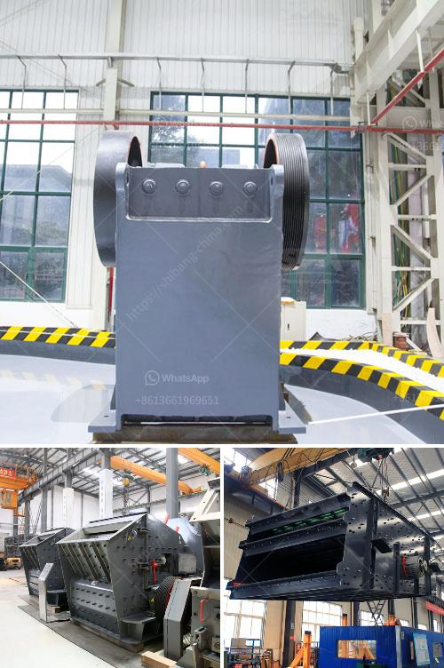

<h3>cost to construct a cement factory</h3>
The cost to construct a cement factory can vary significantly depending on factors such as the location, size, and specific requirements of the project. As per a study conducted by the European Cement Research Academy (ECRA), the average capital cost per ton of cement produced amounted to €210 in 2011. Considering the worldwide cement production in 2019 was approximately 4.1 billion tons, it gives an overall idea that establishing a cement factory involves a substantial investment.

Firstly, one must consider the location of the cement factory. The cost of land or acquiring an existing industrial space can vary greatly based on the region and availability. Urban areas tend to entail higher land prices, which can significantly impact the overall costs. Additionally, accessibility to raw materials and transportation logistics should also be considered when selecting a location.

The size of the cement factory also plays a significant role in determining costs. A small-scale cement plant may require a lower upfront investment compared to a large-scale cement manufacturing facility. Smaller plants generally have lower maintenance, manpower, and operating costs, making them an attractive option for investors with limited financial resources. However, the economies of scale in larger plants may help reduce the production cost per ton of cement, making it more profitable in the long run.

Another major cost factor is the equipment and machinery required for the cement manufacturing process. This includes crushers, ball mills, dust collectors, kilns, coolers, and other key equipment. The prices of these machines can vary depending on their quality, brand, and capacity. Utilizing modern and efficient equipment can help improve the productivity and energy efficiency of the plant, but it may also result in a higher initial investment.

Moreover, environmental regulations and sustainability requirements can significantly impact the cost of constructing a cement factory. Compliance with emissions standards and adopting cleaner technologies may necessitate additional investments in pollution control systems, waste management facilities, and carbon capture technologies. These measures not only reduce the environmental footprint but also ensure compliance with local regulations and improve the overall reputation and market competitiveness of the factory.

Furthermore, hiring skilled manpower, including engineers, technicians, and workers, is essential for operating a cement plant efficiently. The labor costs will depend on the region and the skill level of the employees. Proper training and ensuring a safe working environment may incur additional costs but can significantly enhance productivity and minimize accidents.

Finally, one must consider financing options to cover the construction costs of a cement factory. Traditional sources of funding such as loans from financial institutions, private equity, or joint ventures with other companies can be viable options. In some cases, governments also provide incentives or subsidies to encourage investments in the cement industry, which can help reduce the financial burden.

In conclusion, constructing a cement factory requires careful planning and consideration of various cost factors. The location, size, equipment, labor, environmental requirements, and financing options all contribute to the overall cost. It is crucial for investors and project managers to conduct thorough feasibility studies and engage with experts to accurately estimate and manage the expenses involved in establishing a cement manufacturing facility.
<h3>Contact us</h3><ul><li><strong>Whatsapp:&nbsp;<a href="https://wa.me/8613661969651">+8613661969651</a></strong></li><li><a href="https://swt.shibang-china.com/?git&amp;zhl&amp;cost to construct a cement factory"><strong>Online Service(chat now)</strong></a></li></ul><h3>Related</h3><ul><li><a href='gold mining industry in tanzania.md'>gold mining industry in tanzania</a></li><li><a href='quartz stone crushing machine for stone industries.md'>quartz stone crushing machine for stone industries</a></li><li><a href='slag crusher cost.md'>slag crusher cost</a></li><li><a href='how much price of ball mill.md'>how much price of ball mill</a></li><li><a href='difference between vsi and hsi.md'>difference between vsi and hsi</a></li></ul>