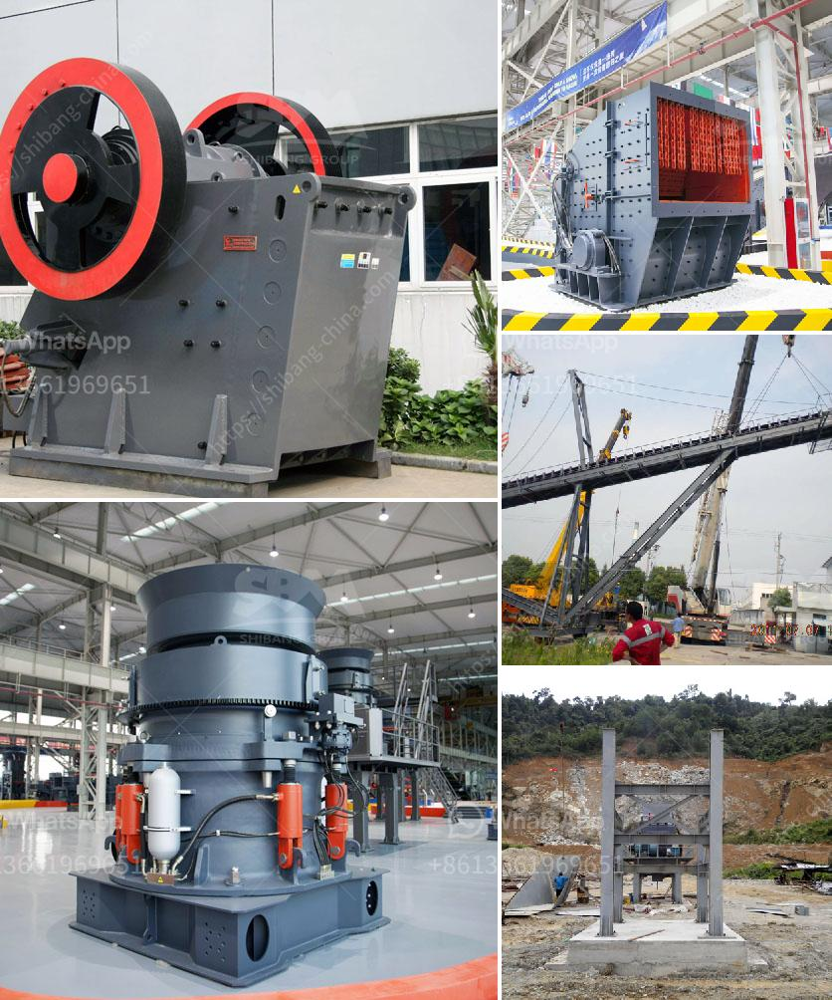

<h3>costruire une machine pour broyer des briques</h3>
La construction et la démolition de bâtiments sont des activités qui génèrent une quantité importante de déchets, notamment des briques. Pour réduire la quantité de déchets et promouvoir le recyclage, il peut être intéressant de construire une machine pour broyer des briques. Dans cet article, nous allons explorer cette idée et discuter des étapes de construction d'une telle machine.

Tout d'abord, il est important de souligner que la construction d'une machine pour broyer des briques doit être réalisée en prenant en compte divers facteurs, tels que la taille et la capacité de la machine, la méthode de broyage, ainsi que la durabilité et la sécurité de l'équipement.

La première étape de la construction d'une machine pour broyer des briques consiste à concevoir le mécanisme de broyage. Il existe différentes méthodes de broyage des briques, notamment l'utilisation de marteaux, de cylindres rotatifs et de couteaux. Chaque méthode a ses propres avantages et inconvénients, et la décision finale dépendra des ressources disponibles et des besoins de l'utilisateur.

Une fois le mécanisme de broyage défini, il est temps de passer à la construction de la machine elle-même. La structure de la machine doit être solide et durable pour résister à l'usure constante causée par le broyage des briques. L'utilisation de matériaux tels que l'acier ou l'aluminium peut garantir une bonne résistance et durabilité.

En ce qui concerne les composants internes de la machine, un moteur puissant est essentiel pour assurer un broyage efficace des briques. Un moteur électrique est souvent préféré en raison de son faible coût d'exploitation, de sa facilité d'utilisation et de sa contribution à la réduction des émissions de carbone. Néanmoins, selon les besoins, d'autres types de moteurs, tels que les moteurs hydrauliques ou à essence, peuvent être utilisés.

La construction d'une machine pour broyer des briques implique également la création d'un système de collecte et de stockage des débris. Il est important de concevoir une trémie ou une goulotte permettant de collecter les briques broyées en toute sécurité. De plus, un dispositif de filtrage peut être ajouté pour séparer les débris plus fins des gros morceaux, contribuant ainsi à la qualité du matériau recyclé.

Enfin, la sécurité est un aspect crucial lors de la construction d'une machine pour broyer des briques. Des mesures de sécurité telles que des barrières de protection, des dispositifs de verrouillage et une formation appropriée des opérateurs doivent être mises en place pour prévenir les accidents et garantir l'utilisation correcte de la machine.

En conclusion, la construction d'une machine pour broyer des briques peut être une étape importante vers la réduction des déchets et le recyclage des matériaux de construction. Cependant, il est essentiel d'accorder une attention particulière à la conception, à la construction et à la sécurité lors de la fabrication d'une telle machine. De plus, il est recommandé de consulter des experts en génie mécanique ou des ingénieurs spécialisés dans les technologies de recyclage pour garantir une construction efficace et durable de cette machine.
<h3>Contact us</h3><ul><li><strong>Whatsapp:&nbsp;<a href="https://wa.me/8613661969651">+8613661969651</a></strong></li><li><a href="https://swt.shibang-china.com/?git&amp;zhl&amp;costruire une machine pour broyer des briques"><strong>Online Service(chat now)</strong></a></li></ul><h3>Related</h3><ul><li><a href='suppliers of ld slag crushing plants in india.md'>suppliers of ld slag crushing plants in india</a></li><li><a href='crushers plant cost.md'>crushers plant cost</a></li><li><a href='crushing and screening contractors in gauteng.md'>crushing and screening contractors in gauteng</a></li><li><a href='used raymond roller mills for sale.md'>used raymond roller mills for sale</a></li><li><a href='limestone calcium hydroxide machine.md'>limestone calcium hydroxide machine</a></li></ul>