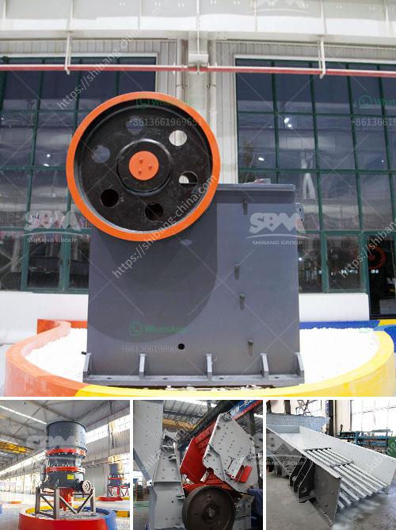

<h3>costs for a stone crusher plant</h3>
Stone crusher plant is a profitable venture for new entrepreneurs. The demand for quality stone chips is increasing day-by-day. With the growing infrastructure developments in various parts of the country, the demand for stone chips is likely to increase even more in the near future. This potential market size is attracting new players and entrepreneurs to set up their stone crushing plants.

However, it is essential to consider various factors before investing in a stone crusher plant. The most important factor is the cost of investment, as it determines the financial feasibility of the project. The project cost of a stone crusher plant mainly includes the investment on raw materials, machinery, manpower, and utilities. Depending on the desired output and specific requirements, the gradation, quality, and size of raw materials have a significant impact on project costs.

The cost of a stone crusher plant primarily depends on the production capacity, location, and size of the plant. As the project manager, it is important to choose the right model and conduct a comprehensive cost analysis before making any investment. Here are some factors to consider when analyzing the costs of a stone crusher plant:

1. Production capacity: A stone crusher plant needs to be able to produce enough quantities of products in a given period. Higher production capacities generally require higher investments.

2. Location: The proximity of the plant to raw materials and customers is another important factor. If the plant is located near the raw materials, transportation costs can be significantly reduced.

3. Size of the plant: The size of the plant directly affects the machinery and equipment required. Larger plants may have higher costs in terms of machinery and utilities.

4. Manpower: The number of skilled and unskilled laborers needed to operate the plant is an essential cost factor.

5. Utilities: The cost of electricity, water, and waste management should also be considered as part of the overall cost analysis.

In conclusion, setting up a stone crusher plant requires careful planning and a scientific approach to analyze the various costs involved. Entrepreneurs must ensure that they choose the right model, size, and location for their plant, considering the project's specific requirements and market demand. With proper planning and cost analysis, a stone crusher plant can be a profitable venture for new entrepreneurs.
<h3>Contact us</h3><ul><li><strong>Whatsapp:&nbsp;<a href="https://wa.me/8613661969651">+8613661969651</a></strong></li><li><a href="https://swt.shibang-china.com/?git&amp;zhl&amp;costs for a stone crusher plant"><strong>Online Service(chat now)</strong></a></li></ul><h3>Related</h3><ul><li><a href='vibratory feeders in south africa.md'>vibratory feeders in south africa</a></li><li><a href='small jaw crusher for sale south africa.md'>small jaw crusher for sale south africa</a></li><li><a href='small scale quarry stone making machine.md'>small scale quarry stone making machine</a></li><li><a href='kobe crushers singapore suppliers.md'>kobe crushers singapore suppliers</a></li><li><a href='sand making plant sand washing plant.md'>sand making plant sand washing plant</a></li></ul>