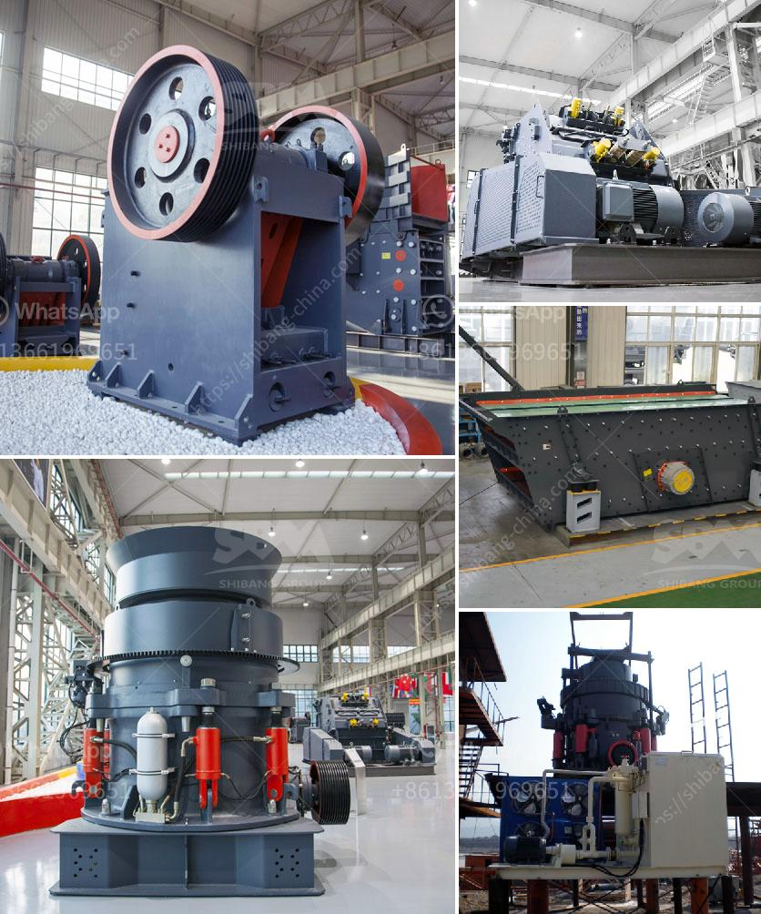

<h3>costs of a cone crusher</h3>
The cone crusher is a common crushing machine used in many fields. It can break hard rocks, ores, and minerals into smaller pieces. In the mining industry, cone crushers are widely used for continuous operation, ensuring high productivity and reducing downtime. The cost of cone crusher maintenance and repairs also negatively impacts profitability.

To better understand cone crusher costs, we must first understand its components. The main frame of the cone crusher is made of cast steel, which is strong and durable. It supports the eccentric shaft and other components, ensuring stable operation. The crushing chamber, also known as the crushing cavity, is formed by the concave and mantle linings. The concave is fixed, while the mantle moves eccentrically to crush rocks. The eccentric shaft, driven by a motor, rotates the mantle, generating crushing forces.

The cone crusher is equipped with various safety devices to protect against overloading and ensure the safety of operators. These include the hydraulic system, hydraulic cylinder, and hydraulic station. The hydraulic system provides overload protection, automatically adjusting the discharge opening to prevent damage to the cone crusher. The hydraulic cylinder controls the clamping force of the concave and mantle, ensuring a secure and tight fit. The hydraulic station supplies power to the hydraulic system, operating the various components.

When it comes to cone crusher costs, three main factors should be considered: initial purchase price, operating costs, and maintenance and repair costs. The purchase price of a cone crusher varies depending on its size and capacity. Larger cone crushers often have higher prices due to their greater production capabilities. However, the initial purchase price is not the only factor to consider.

Operating costs, including energy consumption and wear parts consumption, also significantly impact the overall cost. Cone crushers consume a considerable amount of energy during the crushing process. The motor power, speed, and crushing force all contribute to energy consumption. Additionally, the wear parts of the cone crusher, such as the mantle and concave, need regular replacement due to their constant contact with rocks. Therefore, the cost of replacement parts should be factored into the operating costs.

Maintenance and repair costs are another important consideration. Regular maintenance is essential to ensure the smooth operation of the cone crusher. This includes cleaning, lubricating, and inspecting various components. Some common maintenance tasks include checking and tightening bolts, replacing damaged or worn-out parts, and repairing or replacing hydraulic system components. Ignoring maintenance or delaying repairs can lead to more significant issues and costly breakdowns.

In summary, the cone crusher provides efficient crushing capabilities but comes with various costs that must be taken into account. The initial purchase price, operating costs, and maintenance and repair costs all contribute to the total cost of owning and operating a cone crusher. To maximize profitability, it is essential to choose the right size and capacity cone crusher for your specific needs and properly maintain and repair it throughout its service life.
<h3>Contact us</h3><ul><li><strong>Whatsapp:&nbsp;<a href="https://wa.me/8613661969651">+8613661969651</a></strong></li><li><a href="https://swt.shibang-china.com/?git&amp;zhl&amp;costs of a cone crusher"><strong>Online Service(chat now)</strong></a></li></ul><h3>Related</h3><ul><li><a href='ball mill for pigment.md'>ball mill for pigment</a></li><li><a href='quartz stone crushing machine for stone industries.md'>quartz stone crushing machine for stone industries</a></li><li><a href='second hand crusher machine price.md'>second hand crusher machine price</a></li><li><a href='used mobile jaw crushers for sale in uae.md'>used mobile jaw crushers for sale in uae</a></li><li><a href='mm granite stone jaw crusher.md'>mm granite stone jaw crusher</a></li></ul>