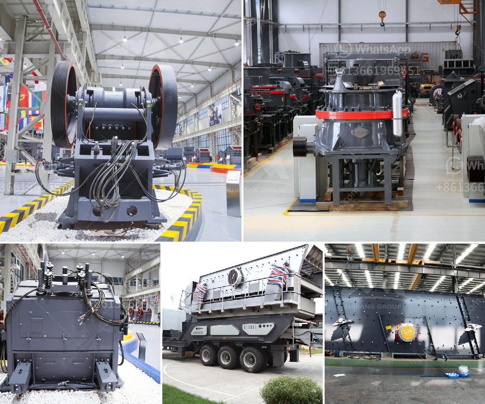

<h3>costs of conveyor belts</h3>
Conveyor belts are an essential component in many industries, playing a crucial role in the transportation of goods and materials. From manufacturing plants and warehouses to airports and mines, conveyor belts are relied upon to move items efficiently from one location to another. However, it is important to understand the costs associated with conveyor belts, as they can significantly impact a company's budget.

The initial cost of conveyor belts can vary depending on several factors. One of the most important considerations is the length and width of the belt required. Longer belts or wider belts will naturally require more material and therefore incur higher costs. Additionally, the type of material used for the belt can affect its price. Conveyor belts are typically made from various materials such as rubber, PVC, or metal. Each material has its own advantages and disadvantages, and the cost will vary accordingly.

Another significant factor influencing the cost is the type of conveyor system required. There are several types of conveyor systems available, including belt conveyors, roller conveyors, and overhead conveyors. The specific needs of a company, such as the weight and size of the items being transported, will determine the appropriate conveyor system. Each system has different setup and maintenance requirements, which can impact the overall cost.

It is also important to consider the ongoing costs associated with conveyor belts. Regular maintenance is essential to ensure the reliable and efficient operation of the conveyor system. This includes routine inspections, cleaning, lubrication, and replacement of damaged or worn-out parts. The cost of maintenance will depend on the complexity of the system and the frequency of inspections. Additionally, companies should allocate a budget for unexpected repairs or replacements to prevent costly downtime.

Energy consumption is another ongoing cost to consider. Conveyor belts require electricity to operate, and the power consumption can vary depending on the size of the system and the load it carries. It is important to choose energy-efficient motors and components to minimize electricity expenses. Implementing strategies such as variable frequency drives can also help optimize energy usage and reduce costs over the long term.

Lastly, installation costs should be taken into account. Installing a conveyor system involves more than just placing the belt on a set of rollers. It requires careful planning, engineering, and integration with existing equipment. Factors such as the location of the conveyor system, accessibility, and necessary modifications to the facility can impact the overall installation cost. It is recommended to consult with experts or professionals to ensure a smooth and cost-effective installation process.

In conclusion, the costs associated with conveyor belts go beyond their initial purchase price. Factors such as the type and size of the belt, conveyor system requirements, ongoing maintenance, energy consumption, and installation should all be considered. By carefully assessing and budgeting for these costs, companies can make informed decisions and ensure the efficient and cost-effective operation of their conveyor systems.
<h3>Contact us</h3><ul><li><strong>Whatsapp:&nbsp;<a href="https://wa.me/8613661969651">+8613661969651</a></strong></li><li><a href="https://swt.shibang-china.com/?git&amp;zhl&amp;costs of conveyor belts"><strong>Online Service(chat now)</strong></a></li></ul><h3>Related</h3><ul><li><a href='mobile stone crusher plant south africa.md'>mobile stone crusher plant south africa</a></li><li><a href='how much does a mobile crusher cost.md'>how much does a mobile crusher cost</a></li><li><a href='msme ball mill project report.md'>msme ball mill project report</a></li><li><a href='jaw crusher agen surabaya.md'>jaw crusher agen surabaya</a></li><li><a href='german crusher plants.md'>german crusher plants</a></li></ul>