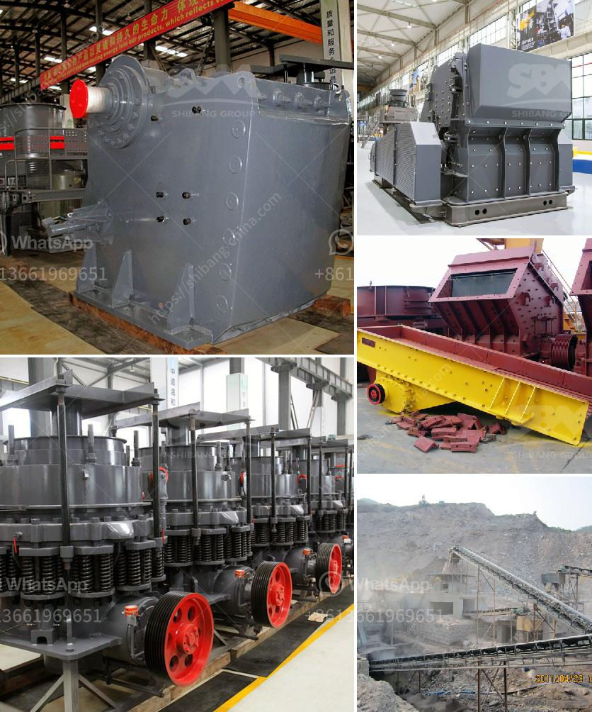

<h3>counting sensors for conveyor belts</h3>
Conveyor belts are used in various industries for the efficient transportation of materials, products, and goods. To optimize their operation, many conveyor systems now incorporate counting sensors. These sensors play a crucial role in accurately tracking the movement of items along the conveyor belt.

Counting sensors enable businesses to keep a precise record of the number of items passing through the conveyor belt. This information is valuable for inventory management, quality control, and overall operational efficiency. By knowing the exact count of items, businesses can ensure timely replenishment of stock, identify potential bottlenecks or issues in the process, and maintain high levels of customer satisfaction.

There are different types of counting sensors available for conveyor belts, depending on the specific requirements of each industry. Some common options include optical sensors, proximity sensors, and ultrasonic sensors. Optical sensors use beam interruption technology to detect the movement of items. Proximity sensors, on the other hand, use electromagnetic fields to identify the presence of objects. Ultrasonic sensors emit sound waves to measure distance and, in turn, count objects passing by.

These sensors are strategically positioned along the conveyor belt to accurately count each item. They are connected to a control system that collects and processes the data, allowing businesses to monitor the flow of materials in real-time. Some counting sensors also offer advanced features such as speed measurement and size detection, providing an even more comprehensive overview of the conveyor belt operation.

In addition to counting sensors, many conveyor systems now incorporate automated sorting mechanisms. These mechanisms use the counting data to divert items into different chutes or belts, based on pre-set criteria. This automation significantly increases operational efficiency, reduces human error, and ensures seamless order fulfillment.

In conclusion, counting sensors have become an essential component of conveyor belt systems. Their ability to accurately track the movement of items contributes to efficient inventory management, quality control, and overall operational excellence. With the advent of automated sorting mechanisms, these sensors have become even more valuable in streamlining processes and optimizing productivity. By investing in counting sensors, businesses can enhance their competitiveness and meet the growing demands of modern industries.
<h3>Contact us</h3><ul><li><strong>Whatsapp:&nbsp;<a href="https://wa.me/8613661969651">+8613661969651</a></strong></li><li><a href="https://swt.shibang-china.com/?git&amp;zhl&amp;counting sensors for conveyor belts"><strong>Online Service(chat now)</strong></a></li></ul><h3>Related</h3><ul><li><a href='cone crusher suppliers in south africa.md'>cone crusher suppliers in south africa</a></li><li><a href='alluvial gold mining project proposal.md'>alluvial gold mining project proposal</a></li><li><a href='crushing mill and impact mill.md'>crushing mill and impact mill</a></li><li><a href='cement plant tons per day.md'>cement plant tons per day</a></li><li><a href='feldspar grinding in raymond mill.md'>feldspar grinding in raymond mill</a></li></ul>