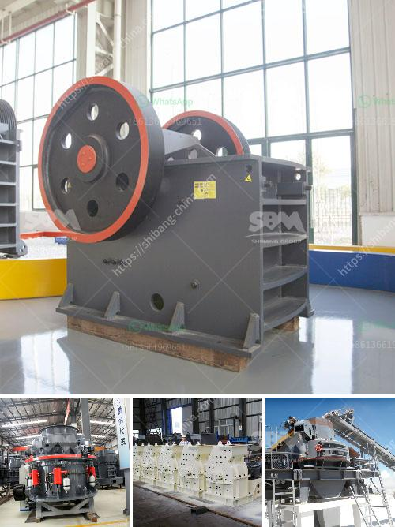

<h3>crsusher plant in the philippines</h3>
Crusher plant in the Philippines plays a crucial role in the construction industry as it facilitates the processing of different types of rocks, such as limestone, granite, river pebbles, and other aggregates used in the construction industry. This machine is used to crush and screen these aggregates to obtain the necessary sizes for the next stage of the construction process.

One of the main advantages of having a crusher plant in the Philippines is the abundance of raw materials available for crushing. A variety of rocks can be found in this country, making it an ideal location for entrepreneurs who want to establish their crusher plants. These raw materials can be easily sourced from nearby quarries, reducing transportation costs and ensuring a steady supply.

Moreover, the construction industry in the Philippines is booming, with numerous infrastructure projects being developed across the country. This provides a huge demand for aggregates, further emphasizing the need for crusher plants. These plants are capable of producing different sizes of crushed rocks, which can be used in various construction applications, including roads, bridges, buildings, and other infrastructure projects.

Furthermore, crusher plants in the Philippines are equipped with advanced technology, which allows for efficient operation and optimal productivity. These machines are designed to withstand harsh working conditions and can be easily maintained. With proper maintenance, crusher plants can last for several years, providing a stable and reliable source of crushed aggregates.

In conclusion, the presence of crusher plants in the Philippines benefits the construction industry by providing a steady supply of crushed aggregates. These plants play a crucial role in the infrastructure development of the country, contributing to economic growth and creating employment opportunities. With the abundance of raw materials and the increasing demand for aggregates, investing in a crusher plant in the Philippines is a wise decision for entrepreneurs looking to thrive in the construction industry.
<h3>Contact us</h3><ul><li><strong>Whatsapp:&nbsp;<a href="https://wa.me/8613661969651">+8613661969651</a></strong></li><li><a href="https://swt.shibang-china.com/?git&amp;zhl&amp;crsusher plant in the philippines"><strong>Online Service(chat now)</strong></a></li></ul><h3>Related</h3><ul><li><a href='mobile crusher made in turkey.md'>mobile crusher made in turkey</a></li><li><a href='granite crusher in.md'>granite crusher in</a></li><li><a href='stone crusher price ton per day.md'>stone crusher price ton per day</a></li><li><a href='crusher machine price in the philippines.md'>crusher machine price in the philippines</a></li><li><a href='pulverizer crusher machine for limestone.md'>pulverizer crusher machine for limestone</a></li></ul>