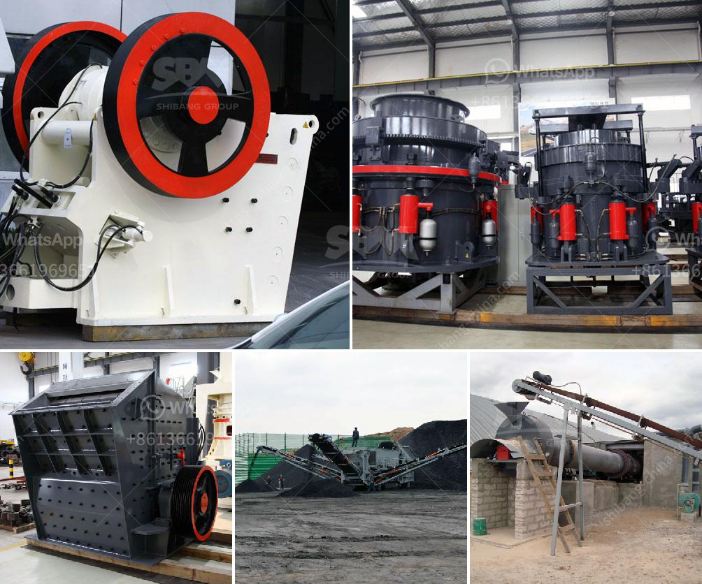

<h3>crush diabase machine</h3>
In today's rapidly evolving world, the construction industry plays a vital role in shaping the urban landscape. As cities expand and infrastructure development continues to surge, the demand for high-quality construction materials has never been more critical. Diabase, a type of igneous rock known for its exceptional durability and strength, has emerged as the go-to material for various construction projects. However, the process of extracting diabase and transforming it into usable crushed stone was not always efficient. Thankfully, technological advancements have led to the introduction of the crush diabase machine, which has revolutionized the construction industry.

The crush diabase machine is an innovative piece of equipment that is specifically designed to break diabase into smaller pieces. This machine is highly efficient and greatly simplifies the process of producing crushed diabase. As a result, it has become an essential tool for many construction companies.

With its robust design and powerful crushing capability, the crush diabase machine can handle large volumes of diabase with ease. Equipped with advanced hydraulic systems, it applies controlled pressure, creating enough force to crush the rock efficiently. This not only saves time but also ensures that the resulting crushed diabase is of superior quality.

One of the key advantages of the crush diabase machine is its versatility. It can be adjusted to produce different sizes of crushed diabase, depending on the specific requirements of a project. This flexibility allows construction companies to cater to a wide range of applications, from road base and concrete production to railway ballast and landscaping.

Efficiency and productivity are essential in any construction project, and the crush diabase machine excels in both areas. By integrating automation and sophisticated control systems, it maximizes the productivity of operators while minimizing the risk of human error. This not only improves overall efficiency but also ensures a consistent output of high-quality crushed diabase.

Additionally, the crush diabase machine is built to withstand the demanding conditions of the construction site. Its durable construction and quality materials make it capable of operating reliably even in harsh environments. This reliability ultimately translates to reduced downtime and maintenance costs, providing peace of mind to construction companies.

Furthermore, the introduction of the crush diabase machine has had a positive environmental impact. By efficiently crushing diabase, construction companies can reduce the need for mining additional natural resources. This not only preserves the environment but also minimizes the carbon footprint of construction projects. As sustainability becomes an increasingly crucial aspect of the industry, the crush diabase machine contributes significantly to the construction sector's efforts in preserving natural resources.

In conclusion, the crush diabase machine has brought about a paradigm shift in the construction industry. With its high efficiency, productivity, and versatility, it simplifies the process of extracting and producing crushed diabase. Construction companies can now rely on this innovative machine to meet the growing demand for high-quality construction materials. The crush diabase machine not only saves time and money but also contributes to a more sustainable and environmentally friendly future for the construction industry.
<h3>Contact us</h3><ul><li><strong>Whatsapp:&nbsp;<a href="https://wa.me/8613661969651">+8613661969651</a></strong></li><li><a href="https://swt.shibang-china.com/?git&amp;zhl&amp;crush diabase machine"><strong>Online Service(chat now)</strong></a></li></ul><h3>Related</h3><ul><li><a href='sale pe series jaw crusher.md'>sale pe series jaw crusher</a></li><li><a href='impact crushing machine manufacturer.md'>impact crushing machine manufacturer</a></li><li><a href='cost of 500 tonnes per day cement plant ecuador.md'>cost of 500 tonnes per day cement plant ecuador</a></li><li><a href='rock pulverizer for manufacturing.md'>rock pulverizer for manufacturing</a></li><li><a href='mini crusher for sale in ireland.md'>mini crusher for sale in ireland</a></li></ul>