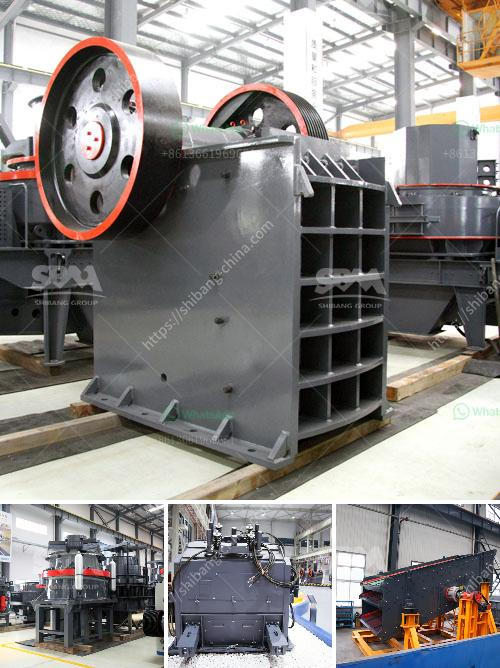

<h3>crush granite machine</h3>
Crushed granite is a type of construction aggregate that is commonly used in residential and commercial landscaping projects. This beautiful, durable stone is sourced from quarries around the world and then crushed to various sizes to meet specific project requirements. To efficiently crush granite into the desired size, a machine known as a granite crusher is needed. This machine is designed specifically for crushing and grinding large chunks of rock into smaller pieces.

A granite crusher machine is typically used to break large pieces of granite into smaller particles. Depending on the desired size of the crushed stone, the crusher machine has a screening machine that allows the smaller pieces of stone to pass through and then expelled from the machine. The larger pieces are fed back into the machine until they are the desired size.

There are several types of granite crushers available in the market, each designed to perform specific tasks. Jaw crushers, impact crushers, and cone crushers are some of the most commonly used machines. Jaw crushers are ideal for primary crushing applications, where the stone is large and hard, while impact crushers are generally used for secondary or tertiary crushing.

Crush granite machines are equipped with strong motors and heavy-duty components, ensuring they can handle the high demands of crushing granite. They are also built to withstand the wear and tear that comes with crushing hard stones. The crushing chamber of the machine is lined with durable materials like manganese steel or cast iron to prevent damage due to abrasive stone particles.

In addition to crushing granite, these machines can also crush other types of stones and rocks, such as limestone, quartz, and even ore minerals. This versatility makes a granite crusher machine a valuable tool in various industries, including construction, mining, and landscaping.

When selecting a granite crusher machine, several factors should be considered. The size and hardness of the stone, as well as the desired output size, will determine the type and size of the machine needed. It is also important to consider the capacity of the machine, as well as the power requirements and maintenance needs.

To ensure the efficiency and longevity of a granite crusher machine, regular maintenance is crucial. This includes cleaning the machine, inspecting and replacing worn parts, and lubricating moving components. It is also important to follow the manufacturer's guidelines and recommendations for maintenance to prevent costly breakdowns and ensure optimal performance.

In conclusion, crush granite machines play a vital role in the construction and landscaping industry, allowing the efficient and effective crushing of granite into various sizes. These machines are designed to withstand the rigorous demands of granite crushing and are equipped with powerful motors and heavy-duty components. With regular maintenance and proper care, a granite crusher machine can provide years of reliable service and contribute to the success of a wide range of projects.
<h3>Contact us</h3><ul><li><strong>Whatsapp:&nbsp;<a href="https://wa.me/8613661969651">+8613661969651</a></strong></li><li><a href="https://swt.shibang-china.com/?git&amp;zhl&amp;crush granite machine"><strong>Online Service(chat now)</strong></a></li></ul><h3>Related</h3><ul><li><a href='silica crusher plant in the philippines.md'>silica crusher plant in the philippines</a></li><li><a href='crusher plant project report pdf.md'>crusher plant project report pdf</a></li><li><a href='indonesia ball mill manufacturer.md'>indonesia ball mill manufacturer</a></li><li><a href='used clay brick machine for sale in germany.md'>used clay brick machine for sale in germany</a></li><li><a href='ball mill for quartz grinding gujarat.md'>ball mill for quartz grinding gujarat</a></li></ul>