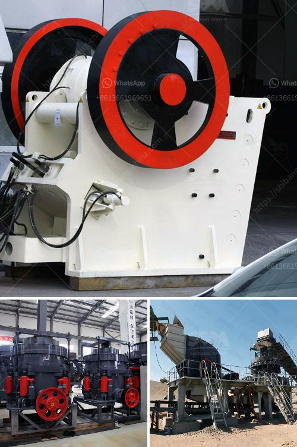

<h3>crushed calcite manufacturer in rajasthan</h3>
Rajasthan, also known as the Land of Kings, is renowned for its rich cultural heritage and magnificent architecture. The state is blessed with abundant mineral resources, making it a hub for various mining activities. Among the numerous minerals found in Rajasthan, calcite holds a significant position. Crushed calcite is widely used in the construction industry due to its versatile nature and unique characteristics.

Calcite is a carbonate mineral primarily composed of calcium carbonate (CaCO3). It is widely distributed and occurs in a variety of geological environments. Rajasthan is a renowned destination for calcite mining, with several mines operating in the state. The calcite extracted from these mines is further processed into various forms, including crushed, powdered, and refined forms.

One of the leading players in the crushed calcite industry in Rajasthan is ABC Mining Corporation. With their state-of-the-art manufacturing unit located in the picturesque district of Udaipur, ABC Mining Corporation is known for producing top-quality crushed calcite. The company employs advanced extraction techniques to ensure that the calcite obtained from their mines is of the highest quality.

The crushed calcite manufactured by ABC Mining Corporation finds extensive use in the construction industry. The unique properties of calcite make it an invaluable material for various applications. One of the primary uses of crushed calcite is in the production of construction aggregates. The small and uniform particle size of crushed calcite makes it an ideal material for creating strong and durable concrete.

Calcite is also extensively used in road construction as a filler material in asphalt and concrete mixtures. The addition of crushed calcite enhances the overall strength and stability of the road surface. Moreover, calcite's superior abrasion resistance makes it a preferred choice for road construction in regions with heavy traffic.

Another significant application of crushed calcite in the construction industry is in the production of lime. Lime is a key ingredient in the manufacturing of cement, steel, and other building materials. The high calcium content in calcite makes it an excellent source of lime when crushed and refined properly.

ABC Mining Corporation ensures that their crushed calcite meets the stringent quality standards set by the construction industry. The company conducts regular quality checks and tests to ensure that their products conform to the required specifications. Additionally, ABC Mining Corporation provides customized solutions to meet the specific requirements of their clients, further enhancing customer satisfaction.

One of the key advantages of ABC Mining Corporation is their commitment to sustainable mining practices. The company adheres to strict environmental regulations and invests in innovative technologies to minimize their ecological footprint. By adopting eco-friendly mining techniques, ABC Mining Corporation ensures the preservation of the natural resources in Rajasthan.

In conclusion, crushed calcite manufacturers like ABC Mining Corporation play a pivotal role in meeting the demands of the construction industry in Rajasthan. Their top-quality products, combined with sustainable mining practices, make them preferred suppliers in the market. With the growing infrastructure development in the region, the need for crushed calcite is expected to rise, further driving the growth of this sector.
<h3>Contact us</h3><ul><li><strong>Whatsapp:&nbsp;<a href="https://wa.me/8613661969651">+8613661969651</a></strong></li><li><a href="https://swt.shibang-china.com/?git&amp;zhl&amp;crushed calcite manufacturer in rajasthan"><strong>Online Service(chat now)</strong></a></li></ul><h3>Related</h3><ul><li><a href='mineral materials crusher.md'>mineral materials crusher</a></li><li><a href='rollers for conveyor belts manizales.md'>rollers for conveyor belts manizales</a></li><li><a href='sand powder milling machine.md'>sand powder milling machine</a></li><li><a href='gypsum board processing machinery.md'>gypsum board processing machinery</a></li><li><a href='components of the nigerian mining industry.md'>components of the nigerian mining industry</a></li></ul>