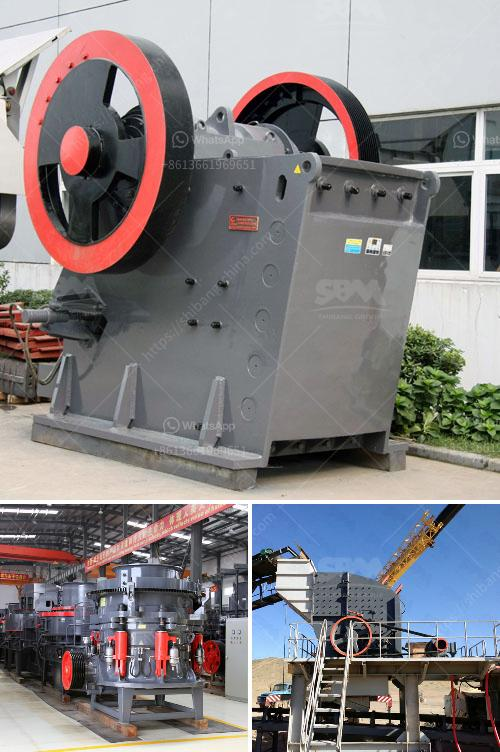

<h3>crushed crusher price</h3>
When it comes to choosing a crusher for your construction or mining project, you may be overwhelmed by the numerous options available in the market. One crucial factor that often dictates your decision-making process is the price. While it's important to consider your budget, you should also prioritize the quality of the crusher you invest in. In this article, we will explore the importance of selecting a high-quality crusher at an affordable price.

First and foremost, let's understand what a crusher is and its role in the construction and mining industry. A crusher is a machine designed to reduce large rocks into smaller rocks, gravel, or rock dust. It is extensively used in various industries to break down materials such as rocks, ores, and minerals into manageable sizes. They are essential in the production of aggregates, which are building blocks for roads, bridges, buildings, and other infrastructure.

Now, why does the price of a crusher matter? One might assume that all crushers function the same and that opting for a cheaper alternative will save money in the short term. However, this is a common misconception that can lead to severe repercussions. A crusher with a lower price tag may seem appealing initially, but it often comes with hidden costs. These costs could entail more frequent repairs and maintenance, decreased production efficiency, and even potential safety hazards.

A lower-priced crusher is usually manufactured with subpar materials and components. It may lack the necessary durability to withstand the harsh conditions of mining or construction sites. Cheaper crushers often have a shorter lifespan and require more frequent replacement parts. Consequently, this leads to increased downtime, reduced productivity, and higher long-term costs. Ultimately, what seems like an economical choice upfront can prove to be financially draining in the long run.

In contrast, investing in a high-quality crusher offers numerous benefits. A reputable manufacturer will utilize premium materials and employ advanced technology in their production process, resulting in a more robust and reliable machine. A superior crusher can handle more substantial workloads, reducing the risk of breakdowns and improving overall productivity. Additionally, it is likely to have better safety features, protecting workers from potential accidents and injuries.

Although a high-quality crusher may have a higher initial price, it will prove to be a worthwhile investment. It offers longevity, efficiency, and lower maintenance costs, improving your bottom line in the long term. Alongside that, it ensures that your project remains on schedule, avoiding costly delays and downtime. Moreover, a reputable manufacturer will often provide warranties and after-sales support, further enhancing the value of your purchase.

In conclusion, while the price of a crusher is an important consideration, it should not be the sole determinant of your choice. Opting for a high-quality crusher may require a higher initial investment, but it offers substantial long-term benefits. By choosing a crusher from a reputable manufacturer, you ensure durability, efficiency, and enhanced safety precautions. Always prioritize quality when making such crucial decisions for your construction or mining project.
<h3>Contact us</h3><ul><li><strong>Whatsapp:&nbsp;<a href="https://wa.me/8613661969651">+8613661969651</a></strong></li><li><a href="https://swt.shibang-china.com/?git&amp;zhl&amp;crushed crusher price"><strong>Online Service(chat now)</strong></a></li></ul><h3>Related</h3><ul><li><a href='harare changfa diesel engine.md'>harare changfa diesel engine</a></li><li><a href='grinding feldspar for glazes.md'>grinding feldspar for glazes</a></li><li><a href='caco3 manufacturing process.md'>caco3 manufacturing process</a></li><li><a href='new crushing machine in south africa.md'>new crushing machine in south africa</a></li><li><a href='ball mill inside.md'>ball mill inside</a></li></ul>