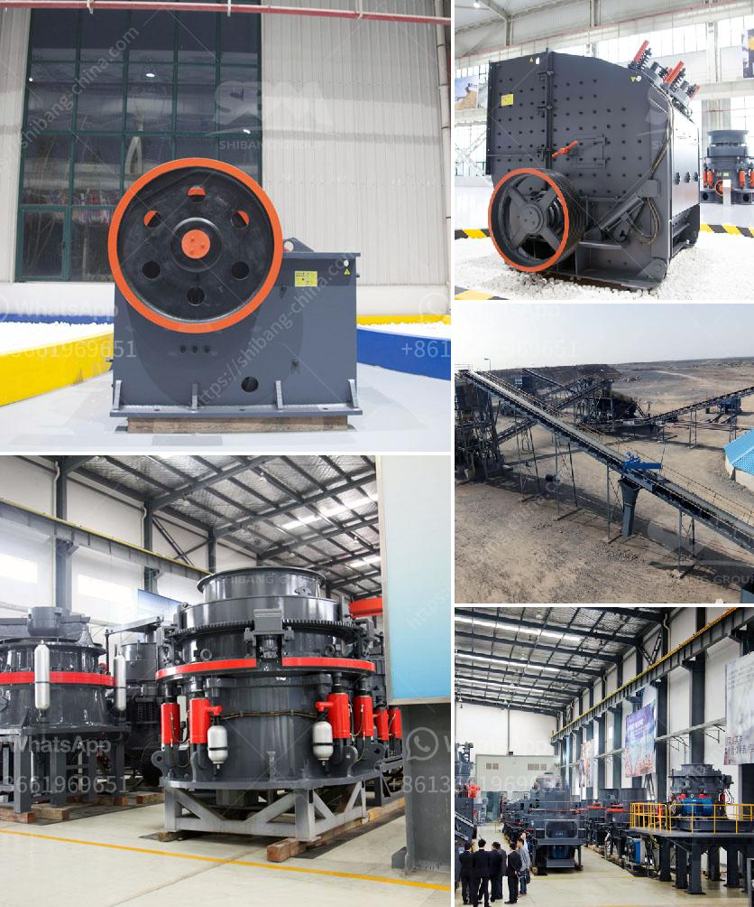

<h3>crushed stone sorting machinery</h3>
Crushed stone is an essential resource for construction projects. It is used as a base material for laying roads, driveways, and foundations. In fact, crushed stone is the most widely used construction material in the world. With such high demand, the need for efficient and reliable machinery to sort and process this material becomes crucial. This is where crushed stone sorting machinery comes into play.

The process of sorting crushed stone starts with the extraction of natural aggregates from quarries. These aggregates are then transported to a crushing plant, where they are further crushed into smaller sizes. After crushing, the stones are sorted based on their size, shape, and quality.

Crushed stone sorting machinery includes vibrating screens, feeders, conveyors, and crushers. Each machine plays a specific role in the processing of crushed stone. Vibrating screens are used to separate the larger rocks from smaller ones, while feeders are used to control the flow of material into the crusher. Conveyors transport the material from one stage of the sorting process to another. Finally, crushers are used to reduce the size of the stones into more manageable sizes.

One of the main challenges in crushed stone sorting is the variation in size and shape of the aggregates. Depending on the source and type of stone, the sizes and shapes can differ significantly. This makes it essential for sorting machinery to have adjustable settings and screens to accommodate different material specifications. Additionally, the machinery should be able to quickly adapt to changes in the input material to maintain a consistent product quality.

Another challenge in crushed stone sorting is the presence of impurities and unwanted materials. These can include debris, clay, dirt, and other organic matter. Sorting machinery needs to have effective separation methods to remove these impurities and ensure a clean final product. Techniques such as screening, air separation, and water washing can be used to achieve efficient separation of impurities.

In recent years, advancements in technology have led to the development of more efficient and sophisticated crushed stone sorting machinery. Automation and computer-controlled systems have significantly improved the accuracy and speed of the sorting process. This allows for higher productivity, reduced labor costs, and improved product quality.

Furthermore, the use of AI and machine learning algorithms has enabled sorting machinery to learn and adapt to different types of materials. This means that the machines can continuously optimize their performance based on the specific characteristics of the crushed stone being processed.

In conclusion, crushed stone sorting machinery plays a vital role in the construction industry. It helps to ensure that the extracted natural aggregates are processed efficiently and effectively. With the right machinery, construction projects can benefit from high-quality crushed stone that meets their specific requirements. As technology continues to advance, it is expected that crushed stone sorting machinery will become even more sophisticated and efficient, allowing for increased productivity and cost-effectiveness in construction projects.
<h3>Contact us</h3><ul><li><strong>Whatsapp:&nbsp;<a href="https://wa.me/8613661969651">+8613661969651</a></strong></li><li><a href="https://swt.shibang-china.com/?git&amp;zhl&amp;crushed stone sorting machinery"><strong>Online Service(chat now)</strong></a></li></ul><h3>Related</h3><ul><li><a href='ball mill for sale in india.md'>ball mill for sale in india</a></li><li><a href='60ton ball mill nigeria.md'>60ton ball mill nigeria</a></li><li><a href='cost of setting up a stamp mill in zimbabwe.md'>cost of setting up a stamp mill in zimbabwe</a></li><li><a href='granite processing machinery.md'>granite processing machinery</a></li><li><a href='gravel crushers machine.md'>gravel crushers machine</a></li></ul>