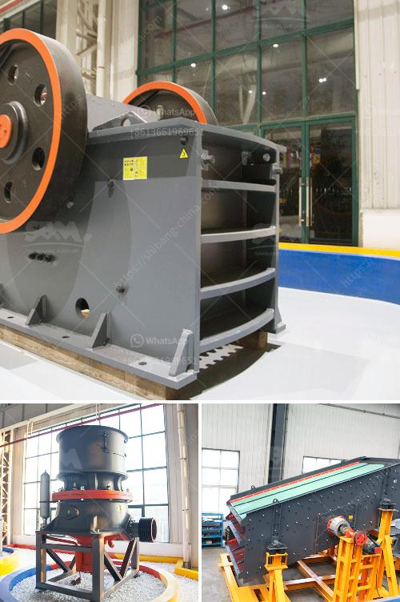

<h3>crusher company in kenya</h3>
In recent years, Kenya has experienced an increase in the number of companies manufacturing crushers. In this article, we will be highlighting the Crusher Company in Kenya.

The company specializes in the manufacturing of various sizes and types of crushers that are used in a variety of industries. It offers an extensive range of products that include jaw crushers, impact crushers, cone crushers, vertical shaft impact (VSI) crushers, and more.

One of the reasons why the Crusher Company in Kenya has been able to thrive in the industry is due to the high-quality products it offers. The crushers are made using the latest technology and are designed to meet international standards. This ensures that customers get reliable and durable machines that offer excellent performance.

Furthermore, the company places a strong emphasis on customer satisfaction. It offers excellent customer service, and its team is always ready to assist clients with any queries or concerns they may have. The company also provides after-sales support, ensuring that customers are fully satisfied with their purchase.

The Crusher Company in Kenya is known for its ability to deliver crushers efficiently and on time. It has a streamlined manufacturing process that enables it to meet customer demands promptly. The company understands the importance of meeting deadlines, especially in industries where crushers are crucial for operations.

In addition to manufacturing crushers, the company also provides spare parts and accessories. It understands that over time, some parts of the machine may wear out or need replacement. Therefore, it stocks a wide range of spare parts, making it convenient for customers to find the parts they need. This saves them both time and money as they do not have to wait for parts or source them from other suppliers.

The Crusher Company in Kenya is also committed to environmental sustainability. It has implemented various measures to reduce its carbon footprint and minimize the impact of its operations on the environment. The company ensures that its manufacturing processes are energy-efficient, reducing the use of non-renewable resources. It also prioritizes recycling and waste management to minimize its environmental impact.

As a testament to its excellence, the Crusher Company in Kenya has gained a reputation for its high-quality products and services. It has built strong relationships with many clients and has become a trusted name in the industry. Its crushers are used by various industries, including mining, construction, and demolition, to crush different materials efficiently.

In conclusion, the Crusher Company in Kenya has established itself as a reputable manufacturer of high-quality crushers. Its focus on quality, customer satisfaction, and environmental sustainability has set it apart from its competitors. With a wide range of products, excellent customer service, and a commitment to delivering on time, the company remains a top choice for businesses in need of crushers in Kenya.
<h3>Contact us</h3><ul><li><strong>Whatsapp:&nbsp;<a href="https://wa.me/8613661969651">+8613661969651</a></strong></li><li><a href="https://swt.shibang-china.com/?git&amp;zhl&amp;crusher company in kenya"><strong>Online Service(chat now)</strong></a></li></ul><h3>Related</h3><ul><li><a href='stone crushing feasibility study.md'>stone crushing feasibility study</a></li><li><a href='conveyor belts specifications.md'>conveyor belts specifications</a></li><li><a href='sand screw professional apr.md'>sand screw professional apr</a></li><li><a href='metal corn crusher in china.md'>metal corn crusher in china</a></li><li><a href='mobile crushing plant philippines.md'>mobile crushing plant philippines</a></li></ul>