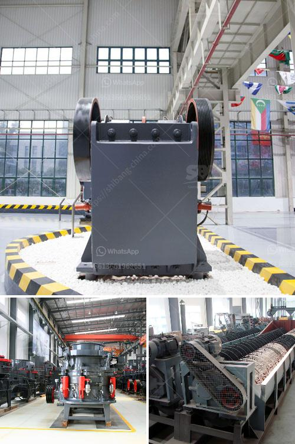

<h3>crusher dealers in kenya</h3>
Kenya is one of the developing countries in Africa with a huge variety of construction projects. It is known for its rising demand for building materials, including sand, ballast, and aggregate. This has led to an increasing need for crushing machinery, making crusher dealers in Kenya essential resources for the construction industry.

Crushers are heavy machinery that are used to break large stones into smaller pieces for various construction projects. They are crucial in road construction, building bridges, and other infrastructure developments. In Kenya, crusher dealers play a crucial role in providing the much-needed machinery and equipment to deliver on these projects.

One of the leading crusher dealers in Kenya is Makiga Engineering Services Limited. With over 30 years of experience in manufacturing and selling crushers, Makiga is renowned for its durable and high-quality machines. They have a range of jaw crushers, stone crushers, and impact crushers that are designed to handle even the toughest of stones and ores. Makiga crushers are well-known for their simplicity, reliability, and cost-effectiveness.

What sets Makiga apart from other crusher dealers in Kenya is their line of manual stone crushers. This is by far the most cost-effective and efficient method when it comes to crushing stones to produce ballast. Makiga stone crushers are designed for primary crushing, and they rely on gridding stones such as granite or basalt to achieve the desired size. They work by applying pressure to the stone, breaking it down into smaller pieces.

In addition to Makiga Engineering, there are several other crusher dealers in Kenya catering to the demands of the construction industry. Some of the notable ones include S.P. Munroe Limited and Panafrican Equipment Kenya Limited. These dealers offer a wide range of crushers, screening machines, and other construction equipment from reputable manufacturers such as Terex, Sandvik, and Powerscreen.

When choosing a crusher dealer in Kenya, it is essential to consider their reputation, product quality, after-sales service, and spare parts availability. Additionally, pricing and financing options can also influence the decision-making process. It is crucial for construction companies to partner with reliable and reputable dealers that can provide the necessary support throughout the project's lifecycle.

Furthermore, crusher dealers in Kenya have an opportunity to collaborate with local quarry owners and miners. By establishing strong partnerships with these stakeholders, dealers can ensure a steady supply of raw materials for their crushers. This symbiotic relationship can contribute to the growth of the construction industry and the overall economic development of the country.

In conclusion, crusher dealers in Kenya play a vital role in providing the necessary machinery for the country's construction projects. With a boom in infrastructure developments, the demand for crushers is higher than ever before. Dealers like Makiga Engineering Services Limited, S.P. Munroe Limited, and Panafrican Equipment Kenya Limited are helping to meet this demand by offering a wide range of crushers and support services. By choosing the right crusher dealer, construction companies can ensure efficient and cost-effective operations, ultimately leading to successful project completion.
<h3>Contact us</h3><ul><li><strong>Whatsapp:&nbsp;<a href="https://wa.me/8613661969651">+8613661969651</a></strong></li><li><a href="https://swt.shibang-china.com/?git&amp;zhl&amp;crusher dealers in kenya"><strong>Online Service(chat now)</strong></a></li></ul><h3>Related</h3><ul><li><a href='hand operated rock crusher.md'>hand operated rock crusher</a></li><li><a href='ball mill in kazakhstan.md'>ball mill in kazakhstan</a></li><li><a href='mobile stone crushing plant made in germany.md'>mobile stone crushing plant made in germany</a></li><li><a href='mtm trapezium mill.md'>mtm trapezium mill</a></li><li><a href='zimbabwe hammer mills.md'>zimbabwe hammer mills</a></li></ul>