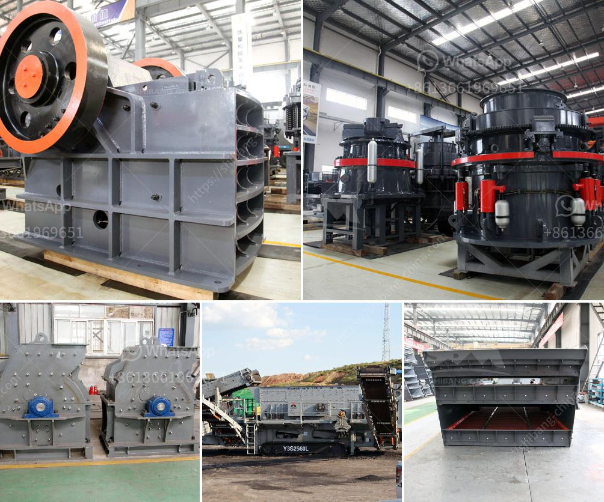

<h3>crusher for granite</h3>
The granite crushers are indispensable in the mining industry nowadays, especially when dealing with granite. It is a hard rock with a high content of silicon dioxide, which is difficult to be broken. Therefore, the crushing process for these materials is often rough and lengthy, requiring a crusher to process the materials.

The impact crusher is commonly used for the crushing of granite. It has a strong crushing force and high crushing efficiency due to the large impact energy produced when materials collide with the plate hammer. It can process granite materials with a side length of 100-500 mm, which can be directly fed into the crushing cavity without the need for preliminary crushing, simplifying the crushing process and reducing investment costs.

The jaw crusher is another commonly used crusher for granite crushing. It has a larger crushing ratio and can accept larger granite materials, which increases the flexibility of the equipment. It is suitable for medium and fine crushing of materials with a compressive strength of up to 350 MPa, such as granite, basalt, limestone, etc. However, the jaw crusher requires a larger space for operation, which makes it less suitable for smaller stone processing businesses.

In addition to the impact crusher and jaw crusher, there are also cone crushers for granite crushing. These machines have become more and more popular in recent years due to their high crushing efficiency and durability. They are known for their ability to crush hard and abrasive materials, including granite. The cone crusher works on the principle of pressing the material against a concave surface to achieve the desired size reduction.

When selecting a crusher for granite crushing, it is important to consider factors such as the hardness of the material, the production requirements, the feeding size, and the required final product size. Based on these requirements, different types of crushers can be chosen to achieve the desired crushing results.

It is important to note that the proper maintenance and regular inspection of the crusher is necessary to ensure its reliable performance and extend its service life. Regular cleaning, lubrication, and timely replacement of worn parts can prevent unexpected downtime and increase productivity.

In conclusion, the crusher for granite plays a crucial role in the stone processing industry. It is a necessary tool for crushing materials into desired sizes for further processing. The impact crusher, jaw crusher, and cone crusher are commonly used for granite crushing, with different crushing capacities and crushing effects. Careful selection and maintenance of the crusher can effectively improve production efficiency and reduce operational costs in your stone processing business.
<h3>Contact us</h3><ul><li><strong>Whatsapp:&nbsp;<a href="https://wa.me/8613661969651">+8613661969651</a></strong></li><li><a href="https://swt.shibang-china.com/?git&amp;zhl&amp;crusher for granite"><strong>Online Service(chat now)</strong></a></li></ul><h3>Related</h3><ul><li><a href='jaw crusher price south africa.md'>jaw crusher price south africa</a></li><li><a href='ball mill in egypt.md'>ball mill in egypt</a></li><li><a href='processing of bauxite ore.md'>processing of bauxite ore</a></li><li><a href='famous manganese cone crusher parts made china.md'>famous manganese cone crusher parts made china</a></li><li><a href='how to build a hammer mill.md'>how to build a hammer mill</a></li></ul>