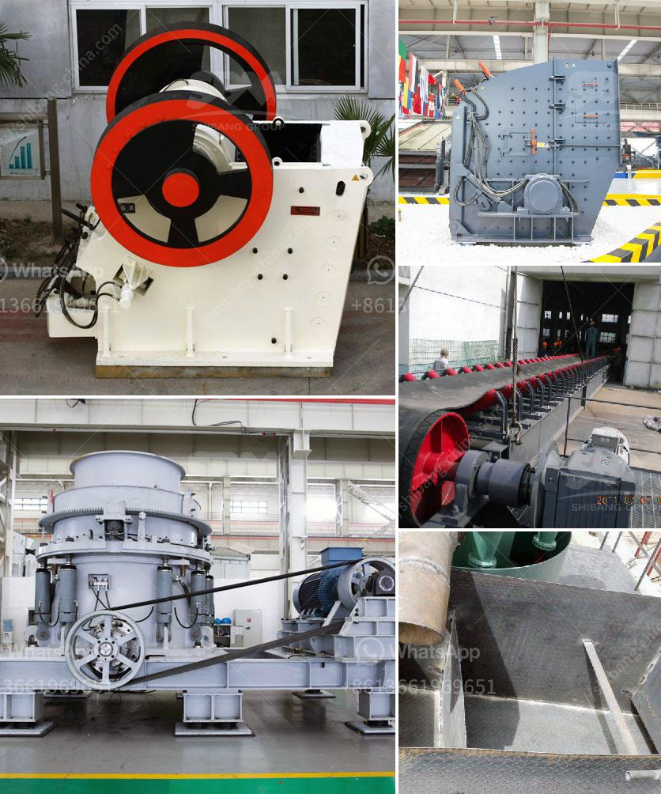

<h3>crusher for quartz</h3>
A crusher for quartz is an essential piece of machinery used for crushing and reducing the size of quartz stones. It is designed specifically to break quartz stones into small pieces and particles for various applications in different industries. Crushing quartz is an intricate process that requires the right equipment and expertise to ensure the desired outcomes.

Quartz is a mineral abundant in the Earth’s crust, known for its durability and versatility. It is widely used in various industries such as construction, electronics, and manufacturing due to its unique properties. However, before it can be utilized, quartz needs to be crushed and processed into smaller sizes.

A crusher for quartz plays a vital role in this process by breaking down larger rocks and stones into smaller, more manageable sizes. This process enables quartz to be used in various applications such as producing concrete, ceramics, and even as a decorative stone in landscaping projects.

There are different types of crushers available for crushing quartz, including jaw crushers, cone crushers, and impact crushers. Each type of crusher has its specific features and advantages, depending on the desired final product size and capacity requirements.

Jaw crushers are commonly used for primary crushing operations, where the quartz stone is initially crushed to a uniform size. Cone crushers are typically utilized for secondary or tertiary crushing, providing a more refined and cubical product. Impact crushers, on the other hand, are used for producing finer particles and can be employed in both primary and secondary crushing stages.

When selecting a crusher for quartz, it is crucial to consider factors such as the desired product size, production capacity, and the hardness of the quartz stone. Additionally, the ease of maintenance and operation should also be taken into account.

In conclusion, a crusher for quartz is an essential tool for breaking down quartz stones into smaller particles to be used in various industries. The different types of crushers available cater to specific needs and requirements, enabling efficient and effective crushing of quartz. By selecting the right crusher for the job, businesses can ensure optimal production and achieve the desired outcomes.
<h3>Contact us</h3><ul><li><strong>Whatsapp:&nbsp;<a href="https://wa.me/8613661969651">+8613661969651</a></strong></li><li><a href="https://swt.shibang-china.com/?git&amp;zhl&amp;crusher for quartz"><strong>Online Service(chat now)</strong></a></li></ul><h3>Related</h3><ul><li><a href='ball mill suppliers uk.md'>ball mill suppliers uk</a></li><li><a href='ball mill hou feng in china.md'>ball mill hou feng in china</a></li><li><a href='top aggregate crusher suppliers in south africa.md'>top aggregate crusher suppliers in south africa</a></li><li><a href='aggregate crushers for sale saudi arabia.md'>aggregate crushers for sale saudi arabia</a></li><li><a href='stone crushing machineries imphal.md'>stone crushing machineries imphal</a></li></ul>