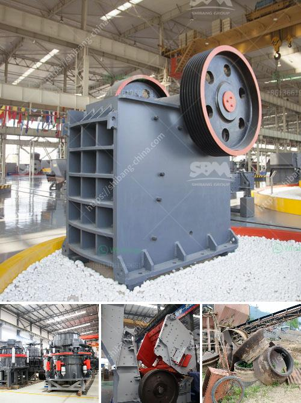

<h3>crusher for sale in sri lanka</h3>
Sri Lanka is located in the tropical belt of South Asia, which has a rich cultural heritage and natural resources. Apart from the stunning beaches, picturesque landscapes, and diverse wildlife, this island nation is also known for its thriving construction industry. With the increased demand for buildings, roads, and other infrastructure projects, the need for efficient materials crushing machinery has become paramount.

One of the essential pieces of equipment in this sector is the crusher. A crusher is a machine that breaks down solid materials into smaller pieces by applying mechanical force. It plays a crucial role in various industries, including mining, construction, and recycling. Whether it's crushing gravel to create concrete or breaking down rocks for use in road construction, a crusher is an indispensable tool.

When looking for a crusher for sale in Sri Lanka, you'll find a vast choice of options. Some come with different types of crusher heads and operating capacities, while others offer various feeding and discharge options. This variety allows you to select the best machine based on your specific requirements.

Crushers can be categorized into different types, such as jaw crushers, cone crushers, and impact crushers. Jaw crushers are commonly used for primary crushing, where stones or rocks are initially crushed to a manageable size. Cone crushers are ideal for secondary and tertiary crushing while ensuring a high reduction ratio. Impact crushers are well-suited for tasks requiring a cubic shape for the final product.

When searching for a crusher for sale in Sri Lanka, it's important to consider factors such as the production capacity, energy consumption, and ease of maintenance. Investing in a high-quality and reliable crusher will ensure optimum performance, reduce downtime, and lower operating costs in the long run.

With the rapid growth of Sri Lanka's construction industry, the demand for crushers is on the rise. Recognizing this need, numerous suppliers and manufacturers now offer a wide range of crushers for sale in Sri Lanka. To make an informed decision, it's advisable to compare different options, read reviews, and consult with experts who can guide you through the selection process.

In conclusion, if you're in the market for a crusher in Sri Lanka, consider the specific requirements of your project and choose a machine that meets those needs. Investing in a quality crusher will not only ensure efficient crushing operations but also contribute to the overall success of your project. So, whether you're a contractor, builder, or involved in the mining industry, a reliable crusher is a vital tool that should not be overlooked.
<h3>Contact us</h3><ul><li><strong>Whatsapp:&nbsp;<a href="https://wa.me/8613661969651">+8613661969651</a></strong></li><li><a href="https://swt.shibang-china.com/?git&amp;zhl&amp;crusher for sale in sri lanka"><strong>Online Service(chat now)</strong></a></li></ul><h3>Related</h3><ul><li><a href='iron ore concentrate prices.md'>iron ore concentrate prices</a></li><li><a href='cost analysis of running a crusher plant.md'>cost analysis of running a crusher plant</a></li><li><a href='100tpd crusher plant.md'>100tpd crusher plant</a></li><li><a href='sandstone crusher.md'>sandstone crusher</a></li><li><a href='quarry equipment for sale in nigeria.md'>quarry equipment for sale in nigeria</a></li></ul>