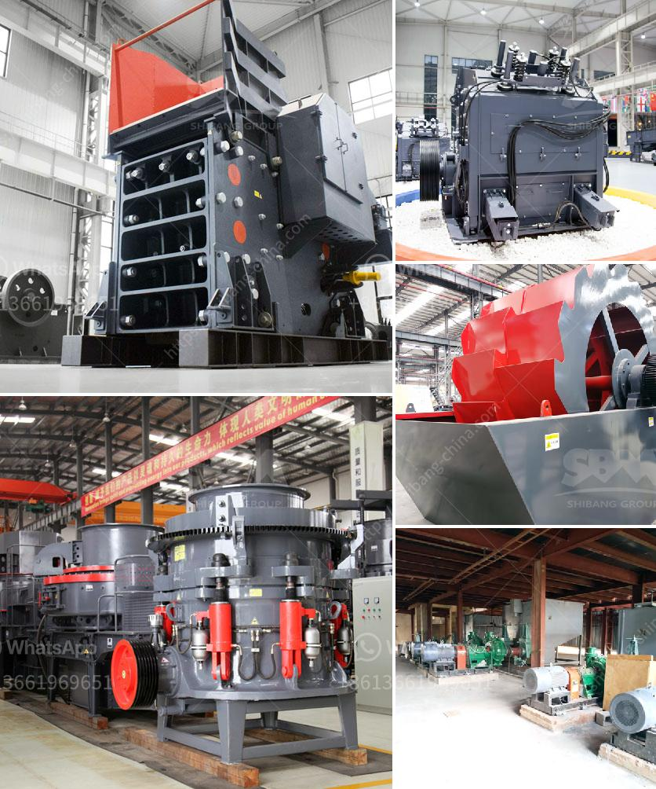

<h3>crusher in hialeah sale</h3>
Are you currently in the market for a reliable crusher in Hialeah? Look no further! Hialeah is a bustling city in Florida known for its construction projects and ongoing infrastructure development. Whether you're a contractor or a DIY enthusiast, finding the right crusher for your needs is crucial to ensure smooth and efficient operations. With a wide range of crushers available for sale in Hialeah, it's essential to understand what factors to consider when making this significant investment.

First and foremost, when shopping for a crusher, it's essential to determine the type and size of the material you'll be crushing. Different materials require varying crusher types, such as jaw crushers, cone crushers, and impact crushers. Analyzing the material you'll be working with will help you choose the appropriate equipment that matches your project's demands.

Next, consider the desired output or production capacity required for your specific application. Some crushers excel at high-volume production, while others are more suitable for smaller-scale projects. Determining your required output will guide you in selecting the right crusher with the appropriate power and capacity.

In addition to performance, it's crucial to prioritize safety and durability. Always opt for crushers that meet industry safety standards and are equipped with safety features to protect operators and prevent accidents. Robust construction and high-quality materials ensure longevity and minimize downtime, saving you money and improving overall project efficiency.

While browsing for a crusher in Hialeah, be sure to partner with reputable sellers or dealers that offer reliable equipment and exceptional customer service. Look for providers who have a track record of supplying well-maintained machinery and offer after-sales support, including maintenance and spare parts availability.

Lastly, always compare prices and seek quotes from multiple sellers to ensure you're getting the best value for your investment. Remember, it's not just about finding the cheapest option but rather striking a balance between cost-effectiveness and equipment quality.

In conclusion, finding the right crusher in Hialeah is essential for your construction projects. Consider factors such as material type, required output, safety features, durability, and reputable sellers to make an informed decision. With careful research and evaluation, you'll be on your way to finding a high-quality crusher that will meet your needs and contribute to the success of your projects. Happy crushing!
<h3>Contact us</h3><ul><li><strong>Whatsapp:&nbsp;<a href="https://wa.me/8613661969651">+8613661969651</a></strong></li><li><a href="https://swt.shibang-china.com/?git&amp;zhl&amp;crusher in hialeah sale"><strong>Online Service(chat now)</strong></a></li></ul><h3>Related</h3><ul><li><a href='copper ore concentration plant supplier.md'>copper ore concentration plant supplier</a></li><li><a href='prices of conveyor belts for mining.md'>prices of conveyor belts for mining</a></li><li><a href='ultrafine mill crusher price in india.md'>ultrafine mill crusher price in india</a></li><li><a href='india conveyor belt for stone crusher.md'>india conveyor belt for stone crusher</a></li><li><a href='quarry machine in nigeria.md'>quarry machine in nigeria</a></li></ul>