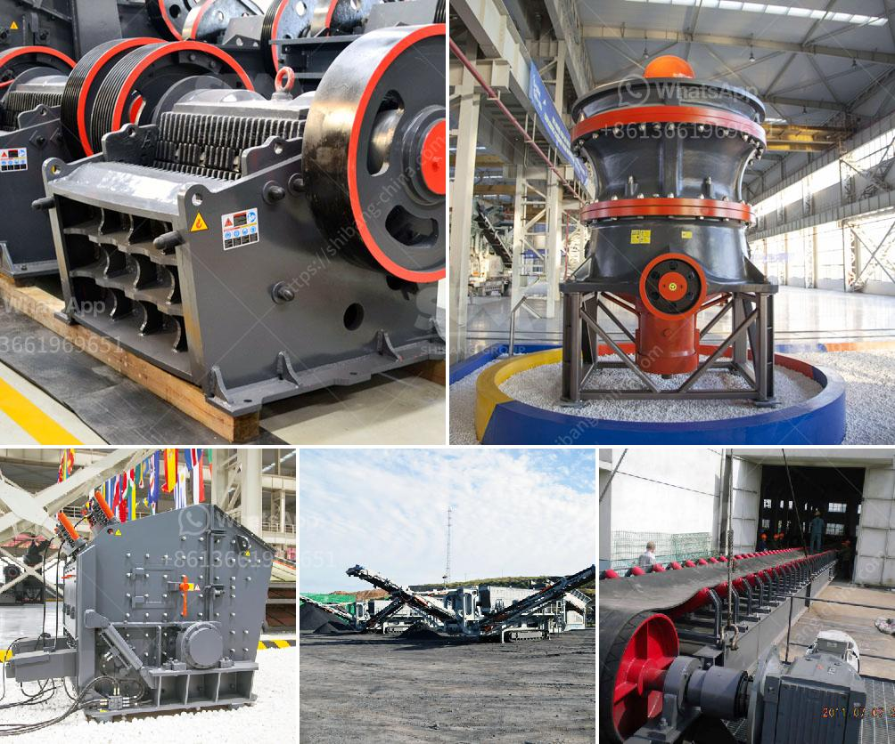

<h3>crusher jaw crusher 10 36</h3>
In the mining and construction industry, the importance of breaking down big rocks into smaller pieces cannot be underestimated. Jaw crushers are the go-to equipment for this task, as they excel at breaking down a variety of materials including granite, limestone, and concrete. One such versatile and efficient jaw crusher is the 10x36 model, which can crush between 300 to 500 tons of material per hour, depending on the type of material and its size.

The 10x36 jaw crusher is designed to process medium to hard quarry rock or other materials, making it an ideal choice for primary crushing applications. The robust design of the machine ensures its durability and longevity, even in the toughest working conditions. Its size and weight make it easy to transport and deploy, allowing for quick and efficient setup on job sites.

With a feed opening of 10x36 inches, the jaw crusher can handle a wide range of feed sizes, from small gravel to larger chunks of rock. The adjustable toggle plate ensures an even distribution of material across the chamber, resulting in consistent product size and increased production efficiency. Additionally, the deep crushing chamber and optimized nip angle provide excellent material reduction and high crushing capacity.

The 10x36 jaw crusher incorporates a reliable and powerful electric motor, which ensures smooth and efficient operation. The motor is also designed to withstand heavy loads and provide consistent performance throughout its lifespan. The machine's simple and user-friendly controls enable operators to quickly adjust the closed side setting and easily toggle between different crushing modes, allowing for greater versatility and productivity.

Maintenance and servicing of the crusher jaw crusher 10x36 are also straightforward, thanks to its accessible design. The machine features a hinged jaw crusher housing, which provides easy access to all components for maintenance and inspection. Additionally, the jaw plates and other wear parts can be quickly and easily replaced, minimizing downtime and ensuring continuous operation.

In conclusion, the crusher jaw crusher 10x36 is a reliable and efficient solution for primary crushing applications. With its durable construction, high crushing capacity, and user-friendly design, it offers great value to any mining or construction operation. Whether processing granite, limestone, or concrete, this jaw crusher can handle the task with ease. By providing consistent product sizes and high productivity, it helps improve overall production efficiency and reduce operating costs.
<h3>Contact us</h3><ul><li><strong>Whatsapp:&nbsp;<a href="https://wa.me/8613661969651">+8613661969651</a></strong></li><li><a href="https://swt.shibang-china.com/?git&amp;zhl&amp;crusher jaw crusher 10 36"><strong>Online Service(chat now)</strong></a></li></ul><h3>Related</h3><ul><li><a href='how to build a hammer mill.md'>how to build a hammer mill</a></li><li><a href='iron crushing machine cost.md'>iron crushing machine cost</a></li><li><a href='vibrating feeders operating parameters from zenith china.md'>vibrating feeders operating parameters from zenith china</a></li><li><a href='ghana quarry crusher.md'>ghana quarry crusher</a></li><li><a href='balls mill in uk.md'>balls mill in uk</a></li></ul>