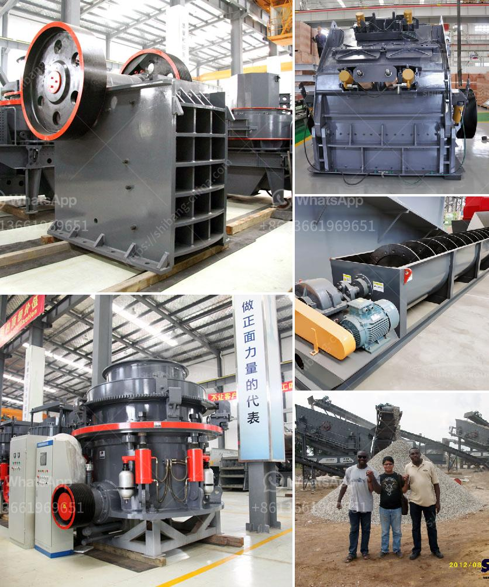

<h3>crusher jaw crusher 16x8</h3>
Crusher machines are widely used in the mining industry for reducing the size of large rocks and ores into smaller pieces. The crushers have become an essential part of many industries, especially in the construction and manufacturing sectors. One such crusher that is commonly used is the jaw crusher.

The jaw crusher is a versatile and powerful machine that is designed to handle any hard rock and ore. It is built with an impact-resistant and durable frame, which ensures its long service life even in the toughest conditions. The crusher jaw is capable of crushing rocks of various sizes and compositions, making it a suitable choice for different applications.

One popular model of the jaw crusher is the 16x8 crusher jaw. This model is known for its high production capacity and low maintenance requirements. The 16x8 crusher jaw features a 16-inch by 8-inch opening, which allows it to handle larger rocks and ores. With a motor power of 30-37 kW and a weight of approximately 7.5 tons, this jaw crusher can efficiently crush a wide variety of materials.

Additionally, the 16x8 crusher jaw is equipped with a hydraulic setting adjustment system, which allows users to easily adjust the size of the output material. This feature ensures that the crusher can produce the desired product size, making it highly efficient for recycling and manufacturing purposes.

Moreover, the 16x8 crusher jaw is designed with safety in mind. It is equipped with a user-friendly control panel that allows operators to easily monitor and control the crusher functions. The machine also has safety features such as a remote-controlled start/stop function and an emergency stop button, ensuring the safety of both the operator and the machine.

In conclusion, the Crusher Jaw Crusher 16x8 is an excellent choice for any industry that requires efficient and reliable crushing equipment. With its robust construction, high production capacity, and user-friendly features, this jaw crusher can effectively reduce the size of rocks and ores, providing excellent results.
<h3>Contact us</h3><ul><li><strong>Whatsapp:&nbsp;<a href="https://wa.me/8613661969651">+8613661969651</a></strong></li><li><a href="https://swt.shibang-china.com/?git&amp;zhl&amp;crusher jaw crusher 16x8"><strong>Online Service(chat now)</strong></a></li></ul><h3>Related</h3><ul><li><a href='25 tph vsi crushers.md'>25 tph vsi crushers</a></li><li><a href='ultrafine grinder for producing powder.md'>ultrafine grinder for producing powder</a></li><li><a href='crushing plant for sale.md'>crushing plant for sale</a></li><li><a href='precipitated calcium carbonate manufacturing machinery.md'>precipitated calcium carbonate manufacturing machinery</a></li><li><a href='ball mill suppliers in south africa.md'>ball mill suppliers in south africa</a></li></ul>