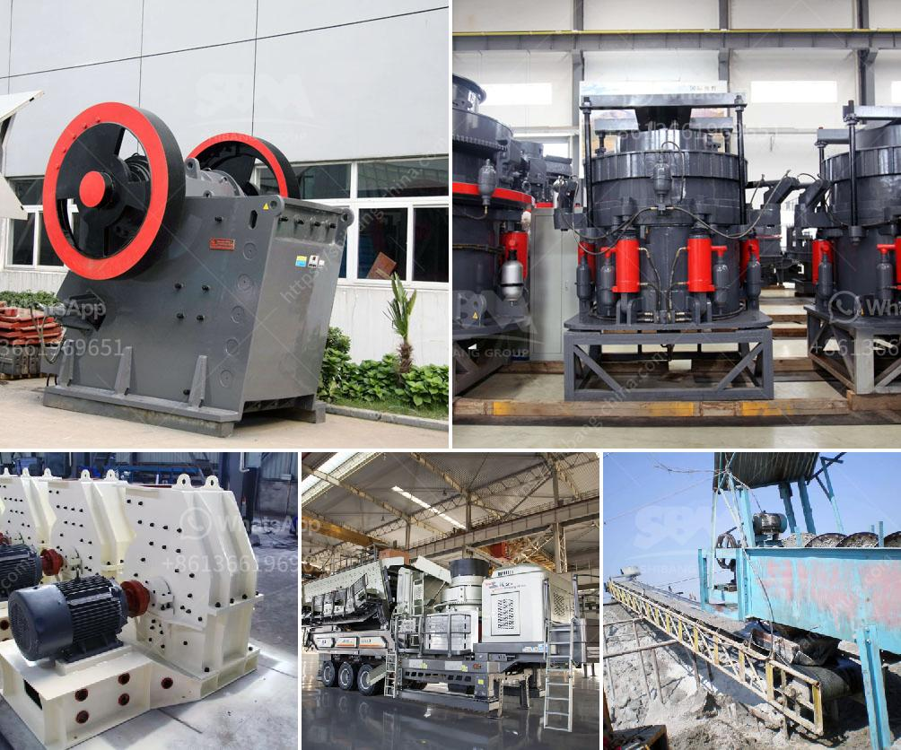

<h3>crusher machine business</h3>
Crusher machines are widely used in the mining and quarrying industry. Today, the crusher machine industry is booming due to the growing demand for aggregates. The global population is expected to hit 8.5 billion by 2030, which translates to a rising demand for aggregates used in the construction of buildings, roads, bridges, and more. This surge in demand has led to an increase in the production of crusher machines.

Crusher machines, also known as crushers, are heavy-duty machines that break larger rocks into smaller, more manageable pieces. Crushers are commonly used in construction and mining industries to crush large rocks and stones into smaller pieces. They are designed for high-performance and reliability, and can be utilized for various applications such as primary crushing, secondary crushing, and tertiary crushing.

One of the key factors driving the growth of the crusher machine industry is the need for efficient crushing solutions. These machines are designed to provide high production rates and exceptional crushing performance while minimizing operational costs and downtime. Crusher machines are equipped with advanced features such as hydraulic settings, automatic tramp release, and tramp iron relief, which ensure efficient and safe operation.

Furthermore, the crusher machine industry is evolving with the introduction of advanced technologies. Automation, artificial intelligence, and the Internet of Things (IoT) are being integrated into crusher machines to enhance their productivity and performance. These technologies enable remote monitoring, predictive maintenance, and real-time data analytics, which help operators optimize crusher performance, reduce downtime, and improve overall operational efficiency.

The crusher machine industry is highly competitive, with numerous players striving to offer innovative solutions to meet customer demands. Key market players are focusing on developing cost-effective and eco-friendly crusher machines that comply with environmental regulations. They are also investing in research and development activities to introduce advanced features and technologies.

Despite the promising growth prospects, the crusher machine business also faces certain challenges. The rising cost of raw materials, stringent regulations, and fluctuating market conditions pose hindrances to the growth of the industry. Additionally, the industry is witnessing a shift towards sustainable practices, pressuring companies to reduce their carbon footprint and minimize the environmental impact of their operations.

In conclusion, the crusher machine business is experiencing significant growth due to the increasing demand for aggregates. With advancements in technology and the need for efficient crushing solutions, the industry is evolving with innovative and eco-friendly crusher machines. However, challenges such as rising costs and environmental regulations need to be addressed by companies to sustain growth in the long run. Overall, the crusher machine industry plays a crucial role in the construction and mining sectors, providing essential materials for infrastructure development and economic growth.
<h3>Contact us</h3><ul><li><strong>Whatsapp:&nbsp;<a href="https://wa.me/8613661969651">+8613661969651</a></strong></li><li><a href="https://swt.shibang-china.com/?git&amp;zhl&amp;crusher machine business"><strong>Online Service(chat now)</strong></a></li></ul><h3>Related</h3><ul><li><a href='stone quarry crusher in ghana.md'>stone quarry crusher in ghana</a></li><li><a href='aggregate crushing flow chart.md'>aggregate crushing flow chart</a></li><li><a href='silica sand plant.md'>silica sand plant</a></li><li><a href='concrete stones crushing business plan.md'>concrete stones crushing business plan</a></li><li><a href='buy mobile crusher in usa.md'>buy mobile crusher in usa</a></li></ul>