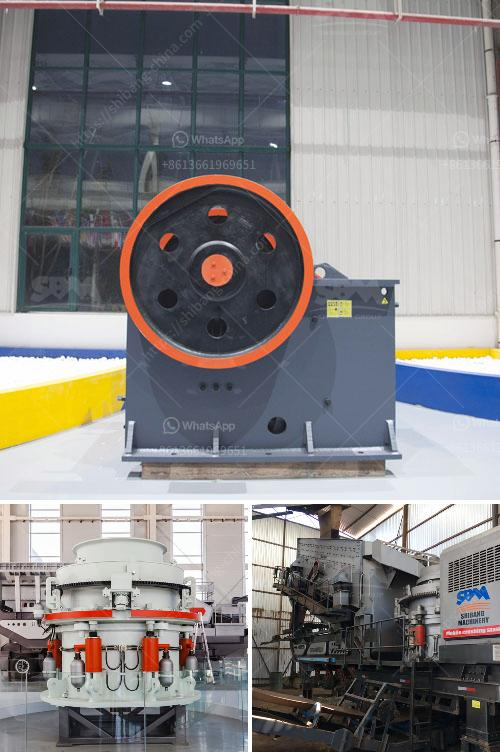

<h3>crusher machine in malaysia</h3>
In Malaysia, the importance of recycling is ever-increasing as the country strives to reduce carbon emissions and protect the environment. Malaysia is committed to managing its waste responsibly and promoting recycling as much as possible. In order to support this initiative, various types of recycling machines are available in the market, including waste plastic and metal crushers. These machines enable efficient and effective recycling of waste materials, ultimately helping Malaysia to achieve its environmental sustainability goals.

One of the key machines in Malaysia that has been widely used in the recycling industry is the pedestal crusher machine. A pedestal crusher machine is a high-powered industrial machine used to crush waste plastics and metal into small pieces or granules. It can efficiently grind and crush various types of waste materials, such as old plastic bottles, factory waste, metal cans, and aluminum scraps, into small and manageable pieces.

The pedestal crusher machine is equipped with a sturdy and heavy-duty motor that enables it to exert high levels of force and pressure to break down waste materials. The powerful motor ensures that the machine can crush even the toughest and largest waste materials, making it an excellent choice for recycling centers and industries dealing with large quantities of waste.

The crusher machine operates by feeding the waste material into a hopper at the top of the machine, where it is then gradually pulled in and crushed between two rotating blades. The crushed material is then discharged through a mesh screen, separating smaller particles from larger ones. This process reduces the volume of waste and prepares it for further recycling or disposal.

In addition to reducing the volume of waste materials, the pedestal crusher machine also helps to ensure the proper disposal of hazardous and non-recyclable waste. By crushing these materials into small pieces, the machine helps to minimize their environmental impact and prevent them from being illegally disposed of in landfills or oceans. This, in turn, helps to preserve and protect Malaysia's natural resources and ecosystem.

Moreover, the crusher machine has also helped to create employment opportunities in Malaysia. As the demand for recycling and waste management increases, more businesses and individuals are investing in crusher machines to set up their own recycling centers or to supplement their existing operations. This has created job opportunities for technicians, engineers, and machine operators, contributing to the growth and development of the local economy.

Overall, the crusher machine plays a crucial role in Malaysia's recycling efforts. It helps to reduce waste volume, promote proper waste disposal, and support the country's environmental sustainability goals. With the increasing focus on recycling and waste management, the demand for crusher machines in Malaysia is expected to continue to rise. As technology advances, more efficient and ecologically-friendly crusher machines are also being developed, providing even better solutions for waste recycling in the future.
<h3>Contact us</h3><ul><li><strong>Whatsapp:&nbsp;<a href="https://wa.me/8613661969651">+8613661969651</a></strong></li><li><a href="https://swt.shibang-china.com/?git&amp;zhl&amp;crusher machine in malaysia"><strong>Online Service(chat now)</strong></a></li></ul><h3>Related</h3><ul><li><a href='pulverizer crusher manufacturers ppt.md'>pulverizer crusher manufacturers ppt</a></li><li><a href='cost of stone crusher plant in saudi.md'>cost of stone crusher plant in saudi</a></li><li><a href='cost of cinder powder in bangalore.md'>cost of cinder powder in bangalore</a></li><li><a href='jaw crusher c160 menghancurkan peralatan.md'>jaw crusher c160 menghancurkan peralatan</a></li><li><a href='limestone grinding process.md'>limestone grinding process</a></li></ul>