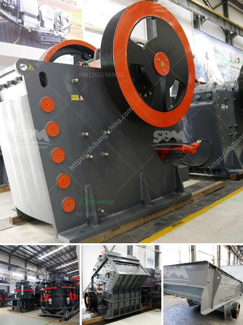

<h3>crusher machine manufacturers shanghai</h3>
Shanghai, also known as the financial hub of China, is a city bustling with economic activities. In this metropolis, one industry that has caught the attention of many is the manufacturing sector. Within this vast realm of manufacturing, crusher machine manufacturers in Shanghai are making a significant impact.

Crusher machines are essential equipment for mining and construction industries. These machines are primarily used to break large rocks, stones, and minerals into smaller pieces, enabling them to be easily transported and processed. From crushing rocks to extracting valuable minerals, crusher machines play a crucial role in ensuring efficient mining operations.

Shanghai, being a progressive city, is the ideal location for crusher machine manufacturers. The city provides a favorable environment for industrial growth, attracting not only domestic enterprises but also international manufacturers. This influx has resulted in a highly competitive market, driving manufacturers to constantly innovate and improve their products.

One such prominent crusher machine manufacturer in Shanghai is Shanghai Shibang Machinery Co., Ltd. In the past few decades, Shibang has been committed to the research, development, and production of mining machinery, offering high-quality products and services to customers worldwide. Their crushers are widely used in various industries such as mining, construction, and cement.

The success of crusher machine manufacturers in Shanghai can be attributed to several factors. Firstly, these manufacturers possess advanced manufacturing facilities and technologies. They invest heavily in research and development to enhance their product performance and efficiency. Moreover, their strong focus on quality ensures that the machines produced are durable, reliable, and meet international standards.

Another factor contributing to the success is their ability to adapt to changing market demands. Shanghai's crusher machine manufacturers are quick to identify industry trends and customer preferences. They continuously upgrade their products to cater to the evolving needs of the market. For instance, with the increasing demand for environmentally friendly machinery, many manufacturers now offer crushers that are energy-efficient and emit minimal pollutants.

Additionally, crusher machine manufacturers in Shanghai prioritize customer satisfaction. They provide excellent after-sales services, including technical support, spare parts supply, and maintenance. This ensures that customers can rely on their machines for long-term operations without interruption.

Furthermore, these manufacturers have strong global networks. Shanghai, being an international business hub, attracts customers from all over the world. Crusher machine manufacturers here have established partnerships and collaborations with distributors and agents in various countries. This enables them to effectively penetrate international markets and serve a diverse range of customers.

In conclusion, crusher machine manufacturers in Shanghai play a crucial role in the mining and construction industries. Their products are essential for breaking and processing large rocks and minerals, contributing to efficient mining operations. These manufacturers exhibit qualities such as technological advancement, adaptability, customer focus, and global reach. As Shanghai's industrial landscape continues to grow, these crusher machine manufacturers are poised to thrive and lead the way in the world of machinery.
<h3>Contact us</h3><ul><li><strong>Whatsapp:&nbsp;<a href="https://wa.me/8613661969651">+8613661969651</a></strong></li><li><a href="https://swt.shibang-china.com/?git&amp;zhl&amp;crusher machine manufacturers shanghai"><strong>Online Service(chat now)</strong></a></li></ul><h3>Related</h3><ul><li><a href='construction waste recycling production line.md'>construction waste recycling production line</a></li><li><a href='dealer of steel balls for ball mill in manila.md'>dealer of steel balls for ball mill in manila</a></li><li><a href='start up procedure for ball mill.md'>start up procedure for ball mill</a></li><li><a href='mini cement plant in pakistan.md'>mini cement plant in pakistan</a></li><li><a href='raymond mill manufacturer.md'>raymond mill manufacturer</a></li></ul>