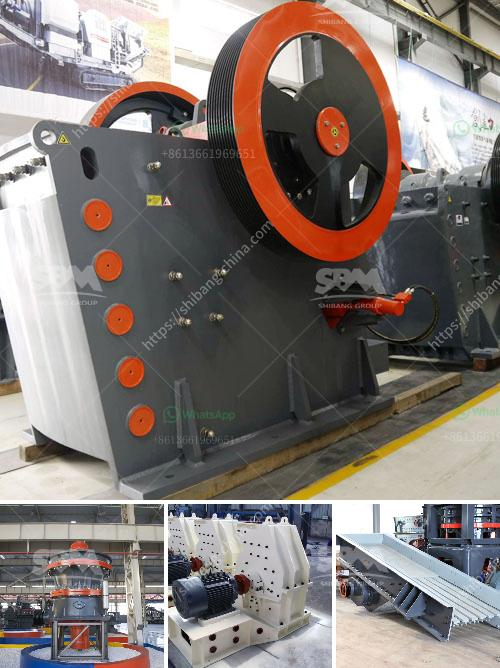

<h3>crusher machine philippine price</h3>
In the Philippines, the construction industry has been growing steadily, fueled by the continuous infrastructure development projects. As a result, the demand for aggregates and other construction materials has increased, creating opportunities for the crusher machine industry to thrive.

A crusher machine is a piece of equipment that grinds, crushes, or pulverizes various types of materials into smaller sizes. These machines are widely used in many industries, including mining, metallurgy, building materials, transportation, and chemical industries. They play a crucial role in breaking down larger rocks, stones, or concrete into smaller, more manageable sizes.

When it comes to choosing a crusher machine, the price is an important consideration. Philippine prices for crusher machines can vary depending on the materials being crushed and the capacity of the machine. However, crusher machines in the Philippines are generally affordable and provide great value for money.

There are various types of crusher machines available in the Philippine market, including jaw crushers, cone crushers, impact crushers, and hammer crushers. Each type of crusher machine has its own unique features and advantages. For example, jaw crushers are suitable for primary crushing, cone crushers are ideal for secondary crushing, and impact crushers are capable of producing fine aggregates.

The price range for crusher machines in the Philippines typically starts from around PHP 50,000 to PHP 1,000,000 and beyond, depending on the brand, size, and capacity. It's worth noting that higher-priced machines often offer more advanced features and better reliability. However, even the more affordable options can still provide efficient and reliable crushing solutions.

When purchasing a crusher machine, it's essential to consider the specific needs and requirements of your project. Factors such as the size and type of materials to be crushed, the required output capacity, and the operation conditions should all be taken into account. Additionally, it's advisable to buy from reputable suppliers who offer after-sales service and technical support.

Overall, crusher machines in the Philippines come at competitive prices and can deliver excellent performance for various crushing applications. With the continuous growth of the construction industry in the country, investing in a crusher machine can prove to be a wise decision. Whether you're in the mining sector or involved in infrastructure projects, having a reliable and efficient crusher machine can significantly improve your productivity and help you meet your project deadlines.
<h3>Contact us</h3><ul><li><strong>Whatsapp:&nbsp;<a href="https://wa.me/8613661969651">+8613661969651</a></strong></li><li><a href="https://swt.shibang-china.com/?git&amp;zhl&amp;crusher machine philippine price"><strong>Online Service(chat now)</strong></a></li></ul><h3>Related</h3><ul><li><a href='aggregate mining process.md'>aggregate mining process</a></li><li><a href='metal corn crusher in china.md'>metal corn crusher in china</a></li><li><a href='stone crushing machines uk.md'>stone crushing machines uk</a></li><li><a href='complete scm stone crushing plant.md'>complete scm stone crushing plant</a></li><li><a href='ceremacs ball mill pictures.md'>ceremacs ball mill pictures</a></li></ul>