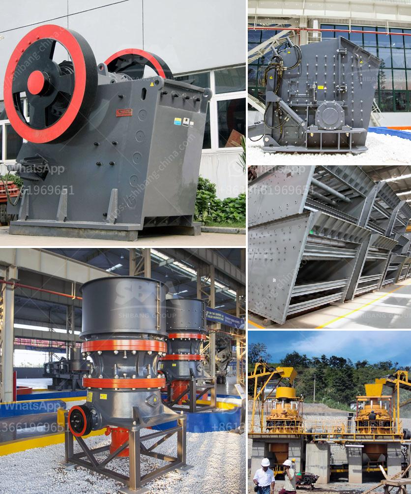

<h3>crusher machine price in sri lanka</h3>
With the rapid economic development in Sri Lanka, many infrastructure projects and mining operations are being carried out, leading to the demand for machinery in the country. As a result, crusher machine has been widely used in various fields, including mining, construction, metallurgy, coal, and so on. However, due to the high initial investment cost, many people are hesitant to buy the crusher machine. In this article, we will discuss the factors influencing the crusher machine price in Sri Lanka.

Firstly, government policies play a crucial role in determining the crusher machine price. Sri Lanka's government has implemented various policies to stimulate economic growth and promote investment in infrastructure and mining. For instance, the government provides tax incentives and subsidies for businesses involved in these sectors. Such policies not only reduce the operating costs for crusher machine manufacturers but also lower the final price for consumers.

Secondly, the crusher machine price is greatly affected by the equipment configuration. The selection of equipment mainly depends on factors such as the raw material properties, production capacity requirements, and final product specifications. Different types and models of crusher machines have different prices. For example, jaw crushers are more expensive than cone crushers and impact crushers. Additionally, the price will also fluctuate based on the brand, manufacturer reputation, and after-sales services provided.

Thirdly, market supply and demand is another significant factor impacting the crusher machine price. When the demand for crushers is high and the supply is low, the price of the machines tends to be higher. Conversely, when the supply exceeds the market demand, the price will decrease. Therefore, it is crucial to analyze the market situation and adjust the purchase time accordingly to get the best price.

Furthermore, transportation costs play a vital role in determining the final price of the crusher machine. Sri Lanka is an island country, and most crusher machines need to be transported from other countries. Therefore, the transportation cost of the equipment is relatively high. Moreover, the distance between the manufacturer and the customer's location also affects the transportation cost. Therefore, it is recommended to choose a local supplier or manufacturer to minimize transportation expenses.

In conclusion, the crusher machine price in Sri Lanka is influenced by several factors, including government policies, equipment configuration, market supply and demand, and transportation costs. It is essential to consider these factors before investing in a crusher machine. Conducting research, comparing prices from different suppliers, and seeking professional advice can help individuals and businesses make cost-effective decisions. By doing so, one can ensure they are getting the best value for their money and contribute to the development of Sri Lanka's infrastructure and mining sectors.
<h3>Contact us</h3><ul><li><strong>Whatsapp:&nbsp;<a href="https://wa.me/8613661969651">+8613661969651</a></strong></li><li><a href="https://swt.shibang-china.com/?git&amp;zhl&amp;crusher machine price in sri lanka"><strong>Online Service(chat now)</strong></a></li></ul><h3>Related</h3><ul><li><a href='industrial ball mill for sale.md'>industrial ball mill for sale</a></li><li><a href='m sand manufacturers in india.md'>m sand manufacturers in india</a></li><li><a href='cement plant tons per day.md'>cement plant tons per day</a></li><li><a href='gypsum manufacturing unit in nigeria.md'>gypsum manufacturing unit in nigeria</a></li><li><a href='cost analysis of running a crusher plant.md'>cost analysis of running a crusher plant</a></li></ul>