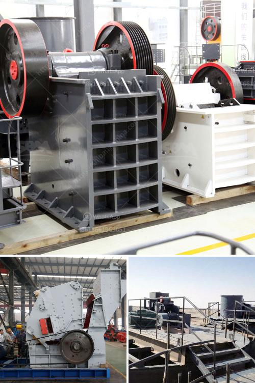

<h3>crusher machine price in the philippines</h3>
The Philippines is a country rich in natural resources. The abundant coconut, rice, and sugar cane fields allow for efficient agriculture. With such a widespread industry, it is no surprise that crusher machines are also widely used for different agricultural purposes. In the Philippines, these machines are also used for recycling purposes, such as oil filters, metal cans, and cardboard. These machines are often installed in waste management facilities, where they help in shredding and grinding waste materials.

One machine that is commonly used in construction is the crusher machine. This machine is specifically designed for breaking large rocks into smaller pieces. The crusher machine price in the Philippines is very reasonable and its performance is quite good. The crushing ratio is large, the efficiency is high, and the quality of the finished product is excellent. Its price is even more attractive to users in the Philippines. Let us take a closer look at this machine.

The main parts of the crusher machine consist of feed hopper, distributor, vortex crushing cavity, impeller, spindle assembly, base, transmission device, and motor. In addition, this machine has a unique liner adjustment and wear-resistant parts. Therefore, it has a longer service life than traditional shredders. Another advantage is that the adjustment device of the machine can be quickly adjusted, which greatly saves the user's time.

In terms of price, the crusher machine price in the Philippines is quite low and the quality is beyond question. Customers from all over the world come to visit and purchase this machine. As we mentioned, a crusher machine price in the Philippines is always a popular topic for people. In the case of construction waste, the crusher machine is also widely used because it can effectively reduce the size and volume of construction waste materials, which can greatly improve work efficiency.

Crusher machine - resources in the Philippines are abundant, and various types of crusher machines such as jaw crushers, roller crushers, and impact crushers can be designed to meet different crushing requirements. In addition, there are many suppliers and manufacturers of crusher machines in the Philippines, so the price is also relatively low. The crusher machine is indeed a necessary equipment in many industries, especially in the Philippines.

In summary, the crusher machine price in the Philippines is favorable and its performance is good. As a professional crusher manufacturer, we can offer complete types of crusher machines for customers. If you want to purchase a crusher machine, please contact us and we will provide you with personalized services.
<h3>Contact us</h3><ul><li><strong>Whatsapp:&nbsp;<a href="https://wa.me/8613661969651">+8613661969651</a></strong></li><li><a href="https://swt.shibang-china.com/?git&amp;zhl&amp;crusher machine price in the philippines"><strong>Online Service(chat now)</strong></a></li></ul><h3>Related</h3><ul><li><a href='mini crusher for gravel sale in philippines.md'>mini crusher for gravel sale in philippines</a></li><li><a href='aggregate wash plant for sale.md'>aggregate wash plant for sale</a></li><li><a href='germany stone crushing plants.md'>germany stone crushing plants</a></li><li><a href='mobile crushing plant philippines.md'>mobile crushing plant philippines</a></li><li><a href='ton per hour hammer mill grinding mill china.md'>ton per hour hammer mill grinding mill china</a></li></ul>