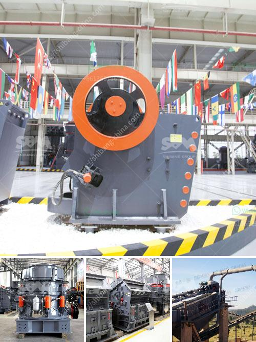

<h3>crusher machine quarry crusher</h3>
A quarry is a site in which a variety of raw materials are extracted from the earth. The materials extracted include limestone, granite, marble and sand. The equipment and machinery used in quarrying are Screens, crushers, shredders and rock drills. We provide all the leading manufacturers such as: Extec, Tesab, Fintec, Brown Lennox, Pegson, Powerscreen and Terex-Finlay. We will match your project requirements with a machine that has the specification capable of carrying out the job you need.

Recently, a quarry plant in Zhongshan, Guangdong Province, a quarry plant cooperative overturned a charm. After years of steady development, the company has grown into an international quarry group with multi-quarry projects and multi-quarry services. Due to the growth in production, the demand for crushing quarry has also increased, and quarry crushers have developed rapidly.

The quarry crusher is a kind of new type high efficient crushing equipment which is developed by our engineers through over 20 year's effort of design, manufacture, sale, and after-sale service in crushing industries. It is widely used in primary crushing, secondary crushing, tertiary crushing and fine crushing.

Quarry crusher machine can be used for hard limestone, granite, basalt, river pebbles, metallurgical slag aggregate and making artificial sand homework hydropower, building materials, roads, urban construction and other industries. Various materials are applicable, which makes the series have a wide range of applications.

Quarry crusher machine adopts high-chromium plate hammer with unique counterattack liner, which effectively enhances the crushing efficiency and productivity. Simplified process, easy to operate, and long service life of wearing parts. The mobile jaw crusher is equipped with high-performance jaw crusher which incudes PE series jaw crusher and PEW series jaw crusher.

The quarry crusher plant has the characteristics of reliable performance, reasonable design, convenient operation and high work efficiency. Configurations of Quarry Crushers: jaw crusher, impact crusher, cone crusher, hammer crusher, vibrating feeder, vibrating screen, belt conveyor and other auxiliary equipment. All these machines combine together to form a complete stone crushing plant.

In conclusion, quarry crusher machine is a reliable equipment in the mining industry. It has the flexibility and mobility that allows you to carry out crushing operations while moving. The high efficiency and low energy consumption make it a preferred choice in the stone crushing plant. Stone crushing plant mainly includes vibrating feeder, jaw crusher, impact crusher, vibrating screen, belt conveyor and centrally electric controlling system, etc. The designed capacity is from 30t/h to 1000t/h. To meet customer's specific requirement, we can also add other equipments such as cone crusher, dust catcher on the production line.
<h3>Contact us</h3><ul><li><strong>Whatsapp:&nbsp;<a href="https://wa.me/8613661969651">+8613661969651</a></strong></li><li><a href="https://swt.shibang-china.com/?git&amp;zhl&amp;crusher machine quarry crusher"><strong>Online Service(chat now)</strong></a></li></ul><h3>Related</h3><ul><li><a href='quarry stone business plan in zimbabwe.md'>quarry stone business plan in zimbabwe</a></li><li><a href='ultrafine grinder for producing powder.md'>ultrafine grinder for producing powder</a></li><li><a href='quarry crushers south africa.md'>quarry crushers south africa</a></li><li><a href='crush diabase machine.md'>crush diabase machine</a></li><li><a href='project report for establishing stone crusher.md'>project report for establishing stone crusher</a></li></ul>